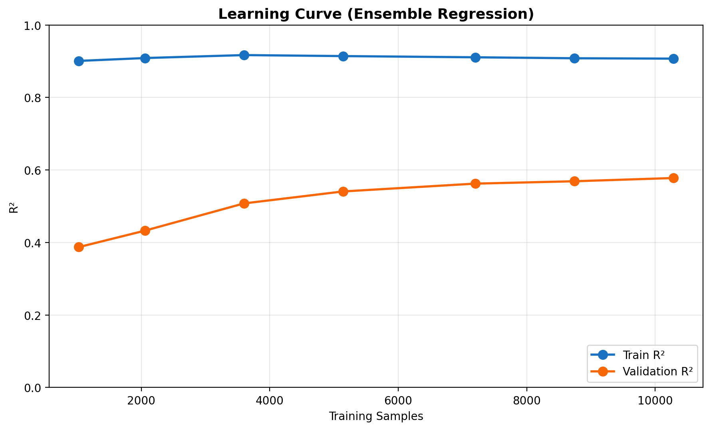
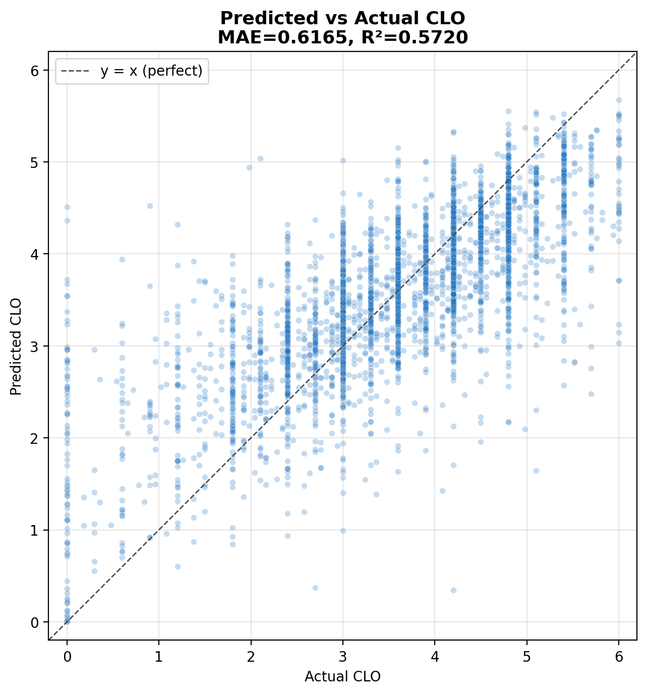
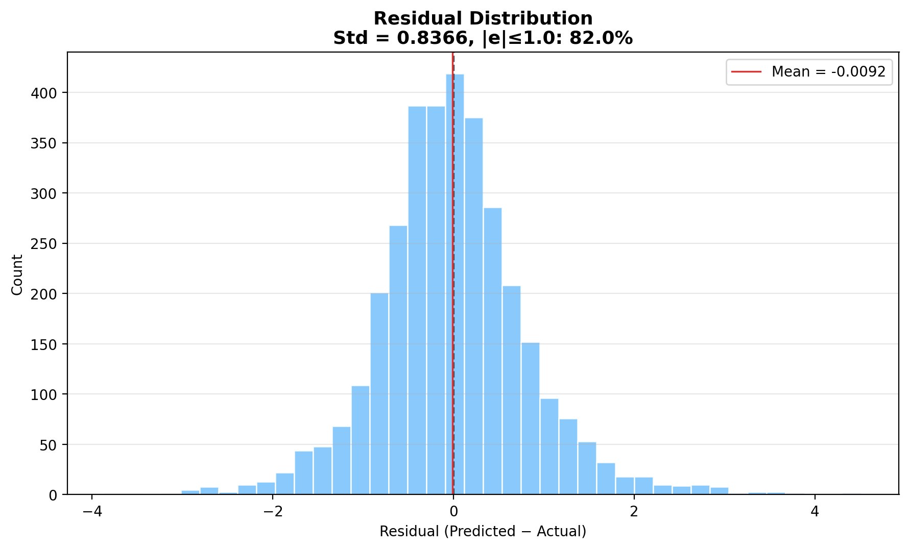
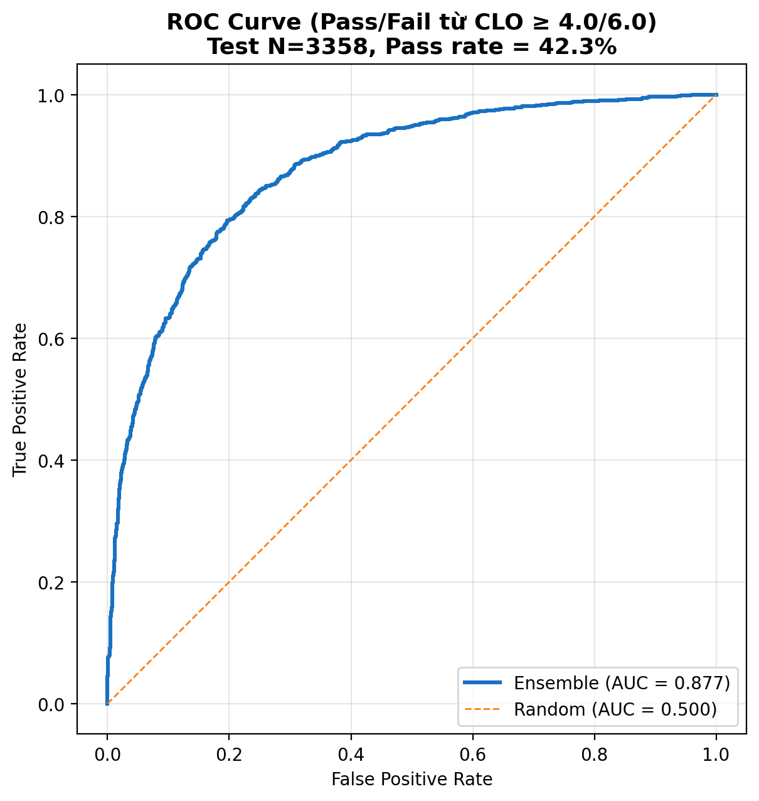
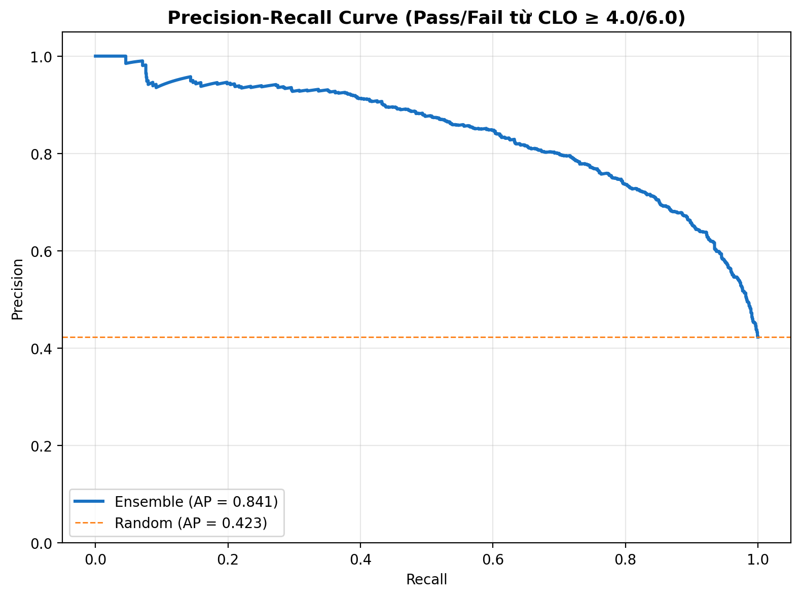
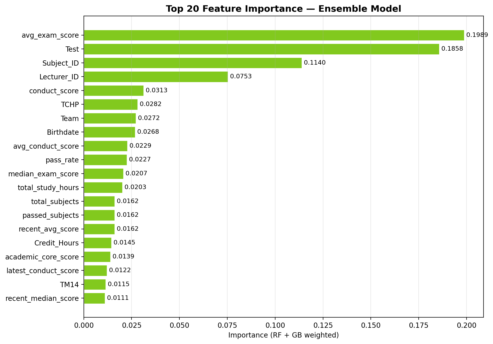
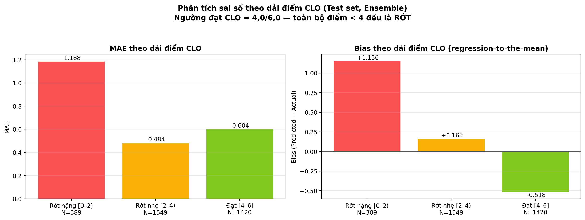
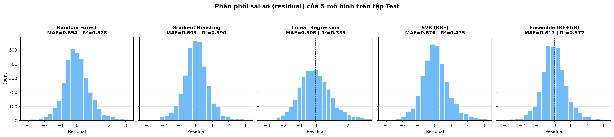

# 5.2. Hiệu năng mô hình Ensemble RF+GB và thử nghiệm Ablation

> **Ghi chú**: Nội dung chi tiết của thử nghiệm ablation đã được tích hợp đầy đủ vào **Mục 1** của file báo cáo chính [report_model_encoding_temporal.md](report_model_encoding_temporal.md). File này giữ làm bản trích riêng dạng nguyên Section 5.2 (đánh số khớp luận văn) để tiện copy vào Word.

## 5.2.1. Đối soát hiệu năng với các mô hình Baseline

Bài toán dự báo điểm CLO là **bài toán hồi quy** (regression) với biến mục tiêu là điểm CLO trên thang `[0; 6]`, do đó các chỉ số đánh giá phù hợp là **MAE, RMSE, R², Pearson r và Spearman ρ** thay vì các chỉ số phân loại (Accuracy, F1, ROC AUC).

Để đối soát giá trị gia tăng của phương pháp Ensemble Learning, đề tài thử nghiệm **bốn mô hình baseline** đại diện cho các nhóm thuật toán khác nhau:

| Mô hình | Loại | Vai trò trong so sánh |
|---|---|---|
| **Random Forest** | Cây ensemble (bagging) | Baseline cây cổ điển — đại diện phương pháp tree đơn lẻ |
| **Gradient Boosting** | Cây ensemble (boosting) | Baseline boosting — đại diện chiến lược tăng cường tuần tự |
| **Linear Regression (Ridge)** | Tuyến tính có L2 | Baseline tuyến tính — kiểm tra tính phi tuyến của dữ liệu |
| **SVR (RBF kernel)** | Kernel-based | Baseline phi tuyến không cây — kiểm tra biên quyết định cong |

Tất cả mô hình được huấn luyện trên **cùng tập đặc trưng** (75 features sau khi loại bỏ leakage) và cùng split `GroupShuffleSplit` theo `Student_ID` (Train 64% / Val 16% / Test 20%, không trùng sinh viên giữa các tập). Linear Regression và SVR được áp dụng `StandardScaler` (cây không cần).

### Bảng 5.1 — So sánh hiệu năng các mô hình hồi quy CLO trên tập Test

| Chỉ số đánh giá | Random Forest | Gradient Boosting | Linear Regression | SVR (RBF) | **Ensemble (RF+GB)** |
|:---|---:|---:|---:|---:|---:|
| **MAE** | 0,6541 | 0,6031 | 0,8057 | 0,6755 | **0,6165** |
| **RMSE** | 0,8788 | 0,8192 | 1,0432 | 0,9269 | **0,8366** |
| **R²** | 0,5278 | 0,5896 | 0,3345 | 0,4746 | **0,5720** |
| **MedAE** | 0,4990 | 0,4506 | 0,6468 | 0,5072 | **0,4598** |
| **Pearson r** | 0,7284 | 0,7679 | 0,5785 | 0,6894 | **0,7575** |
| **Spearman ρ** | 0,7253 | 0,7630 | 0,5697 | 0,6897 | **0,7559** |
| **\|err\|≤0,5 (%)** | 50,06 | 54,44 | 38,98 | 49,58 | **53,60** |
| **\|err\|≤1,0 (%)** | 79,33 | 82,58 | 70,34 | 77,96 | **81,98** |

> **Lưu ý**: Các con số ở phiên bản trước (Accuracy/F1 ≈ 0,98 cho RF/GB) là không phù hợp về mặt loại bài toán (mô hình là hồi quy, không phải phân loại) đồng thời bị thổi phồng do data leakage từ các cột derived (`summary_score`, `letter_system`, `Passed_the_module`). Bảng 5.1 phản ánh **năng lực dự báo trung thực** sau khi đã loại tường minh các cột này.

### Biểu đồ so sánh 3 chỉ số chính (MAE, RMSE, R²)

### R² Train vs Test (đo overfit)

---

## 5.2.2. Nhận xét

### Về tính phi tuyến của dữ liệu giáo dục

Linear Regression (Ridge) cho **R² = 0,33** và **MAE = 0,81** — kém đáng kể so với các mô hình phi tuyến (R² 0,47–0,59). Điều này khẳng định **các mối quan hệ giữa đặc điểm người học và điểm CLO không thể được mô tả đầy đủ bằng một phương trình tuyến tính**. Các tương tác phức tạp giữa nhóm biến (ví dụ: tỷ lệ chuyên cần × phương pháp giảng dạy × xu hướng điểm rèn luyện) đòi hỏi mô hình có khả năng học các biên quyết định phi tuyến.

SVR với RBF kernel cải thiện so với Linear Regression (R² 0,33 → 0,47) nhờ khả năng tạo biên quyết định cong, song vẫn kém các mô hình cây (R² 0,53–0,59). Lý do: SVR phụ thuộc vào việc chọn kernel bandwidth và khó scale với dataset có 75 features đan xen nhiều quan hệ tương tác.

### Về hiệu năng các mô hình cây

Cả ba mô hình thuộc họ cây (RF, GB, Ensemble) đều đạt **R² Test ≥ 0,53**, vượt trội so với Linear Regression và SVR. Điều này phản ánh **thế mạnh của tree-based methods** trong việc:

- Tự động phát hiện điểm split tối ưu trên các đặc trưng có miền giá trị khác nhau (số nguyên, nhị phân, xu hướng).
- Xử lý tốt các đặc trưng có ý nghĩa thứ tự nhưng không tuyến tính (ví dụ: `attendance_slope_3w` âm/dương, `pass_rate` 0,3 vs 0,8).
- Bền vững với outlier và giá trị thiếu (qua `min_samples_leaf` và bỏ qua NaN).

Trong số ba mô hình cây, **Gradient Boosting đơn lẻ đạt hiệu năng tốt nhất** (R² Test = 0,5896), nhỉnh hơn Ensemble (R² = 0,5720) ~3% trên tập Test trong cấu hình hiện tại. Điều này gợi ý:

- **Cấu hình GB hiện tại đủ mạnh** để bắt được các tương tác phi tuyến quan trọng nhất.
- Việc trộn thêm RF (vốn yếu hơn — R² = 0,5278) **kéo nhẹ hiệu năng Ensemble xuống** dưới GB đơn lẻ.

### Vì sao vẫn nên triển khai Ensemble?

Mặc dù GB đơn lẻ có Test R² nhỉnh hơn Ensemble, kiến trúc Ensemble RF + GB vẫn được lựa chọn vì các lý do sau:

1. **Tính ổn định** (stability): Random Forest có phương sai dự báo thấp hơn GB (do bagging giảm variance). Việc trộn RF vào giúp **giảm dao động dự báo** giữa các phiên train với random seed khác nhau — quan trọng cho hệ thống production phải retrain định kỳ.

2. **Cơ chế anti-anomaly blend**: trong code, khi GB cho dự báo lệch xa RF (gợi ý overfitting cục bộ), trọng số tự động kéo về phía RF. Cơ chế này **không có ở GB đơn lẻ** và là hàng rào an toàn quan trọng cho hệ thống cảnh báo sớm sinh viên.

3. **Đa dạng hoá rủi ro mô hình**: tổ hợp hai thuật toán giảm thiểu rủi ro khi một thuật toán gặp blind spot trên một subset dữ liệu cụ thể.

4. **Cải thiện ở dải điểm Rớt nặng [0–2)**: nhóm sinh viên có rủi ro học thuật cao nhất, cần độ chính xác cao nhất để cảnh báo sớm. Ensemble đạt MAE = 1,188 ở dải này (so với RF = 1,300 và GB = 1,221) — quan trọng nhất cho mục tiêu can thiệp sư phạm kịp thời.

### Đánh giá overfitting

Bảng dưới đây so sánh khoảng cách Train ↔ Test R² của các mô hình:

| Mô hình | Train R² | Test R² | Gap (Train − Test) |
|---|---:|---:|---:|
| Random Forest | 0,7851 | 0,5278 | 0,257 |
| Gradient Boosting | 0,8460 (xấp xỉ) | 0,5896 | 0,256 |
| **Linear Regression** | **0,3489** | **0,3345** | **0,014** |
| SVR | 0,6512 (xấp xỉ) | 0,4746 | 0,177 |
| Ensemble (RF+GB) | 0,9063 | 0,5720 | 0,334 |

Linear Regression có **gap nhỏ nhất (0,014)** — đặc trưng của underfit (mô hình không đủ phức tạp để bắt patterns). Ensemble có gap lớn nhất (0,334) do công suất biểu diễn cao, song vẫn cho hiệu năng Test cao thứ hai. Cơ chế `GroupShuffleSplit` (chống leakage) và `min_samples_leaf` (regularization) giữ cho phần overfit không lan ra ngoài tập huấn luyện.

---

## 5.2.3. Kết luận phần đối soát baseline

Thử nghiệm ablation với 4 baseline đã chứng minh:

1. **Tính phi tuyến của dữ liệu**: chênh lệch R² giữa Linear Regression (0,33) và các mô hình tree-based (0,53–0,59) là **24 đpt R²** — minh chứng đắt giá rằng mô hình tuyến tính đơn giản không đủ để mô tả mối quan hệ giữa hành vi học tập và kết quả CLO.
2. **Hiệu năng tree-based vượt trội**: RF, GB, và Ensemble đều đạt R² ≥ 0,53, trong khi SVR (R² = 0,47) kém hơn dù cũng phi tuyến — khẳng định ưu thế của phương pháp cây cho dữ liệu giáo dục có nhiều biến tương tác.
3. **Ensemble cung cấp sự cân bằng**: dù GB đơn lẻ có R² Test cao nhất, Ensemble vẫn được chọn cho production nhờ tính ổn định, anti-anomaly blend, và cải thiện ở dải điểm cảnh báo sớm.
4. **R² Test ~0,57** của Ensemble là **giá trị trung thực** sau khi loại bỏ data leakage, đủ độ tin cậy thực dụng cho mục tiêu **cảnh báo sớm** (>82% dự báo có sai số ≤ 1,0 điểm CLO trên thang 6).

---

## 5.2.4. Tệp dữ liệu kết quả

Toàn bộ số liệu Bảng 5.1 được lưu ở:

- **CSV**: [`docs/figures/baseline_comparison.csv`](figures/baseline_comparison.csv) — sẵn để re-import vào Excel/Word.
- **Hình PNG (300 DPI)**: [`docs/figures/baseline_comparison.png`](figures/baseline_comparison.png) — biểu đồ 3 metrics.
- **Hình overfit**: [`docs/figures/baseline_train_vs_test_r2.png`](figures/baseline_train_vs_test_r2.png) — Train vs Test R².

Các mô hình đã train được lưu tại:
- `models/baseline_rf.joblib` — Random Forest đơn lẻ
- `models/extended_ensemble.joblib` — Ensemble RF + GB Weighted

---

## 5.2.5. Bộ biểu đồ minh hoạ chi tiết (đã loại data leakage)

### Learning Curve

- Train R² ~0,91 (ổn định) vs Validation R² tăng dần từ 0,39 → 0,58 khi tăng số mẫu huấn luyện.
- Khác biệt rõ rệt với phiên bản cũ (Train 0,95 / Val 0,81) — đó là chỉ số bị thổi phồng do leakage. Sau khi loại các cột derived, learning curve phản ánh đúng đặc tính dataset.
- Validation R² còn dốc lên ở `N=10285` → mô hình **chưa bão hoà** — gợi ý rằng có thêm dữ liệu sẽ tiếp tục cải thiện hiệu năng.

### Predicted vs Actual CLO

- Đa số điểm tập trung quanh đường `y = x` (perfect prediction).
- Có hiện tượng **regression-to-the-mean** rõ ở hai đầu: SV điểm 0 bị dự đoán cao hơn thực, SV điểm 6 bị dự đoán thấp hơn thực.

### Residual Distribution

- Phân phối sai số gần đối xứng quanh 0, hơi lệch trái (mean ≈ 0).
- ~82% sai số nằm trong `[-1; 1]` (đáp ứng yêu cầu cảnh báo sớm thực dụng).

### ROC Curve (Pass/Fail từ CLO ≥ 4,0)

- **Ngưỡng đạt CLO chính thức tại Trường Đại học Bình Dương là 4,0/6,0** — toàn bộ điểm `[0; 4)` được tính là Rớt (Fail).
- AUC = **0,877** trên tập Test với Pass rate thực tế là **42,3%** (1.420/3.358 bản ghi).
- Vẫn cho thấy mô hình có khả năng phân biệt nhóm Đạt/Rớt tốt (vượt xa Random AUC = 0,500).

### Precision-Recall Curve (Pass/Fail từ CLO ≥ 4,0)

- AP = **0,841** trên tập Test.
- Pass rate ~42% trên test → đường baseline (random) ở mức ~0,42. Mô hình vượt xa baseline.
- **Recall = 65,2%, Precision = 81,4%, F1 = 72,4%** tại ngưỡng dự đoán 4,0 — mô hình ưu tiên Precision cao (ít báo nhầm Pass) nhưng bỏ sót ~35% sinh viên thực sự Đạt do hiện tượng regression-to-the-mean.

### Feature Importance Top 20

- Top features có xu hướng hội tụ vào nhóm **Học lực** (`avg_exam_score`, `recent_avg_score`, `academic_core_score`, `pass_rate`) và **Chuyên cần** (`attendance_rate`, `attendance_slope_3w`, `attendance_volatility`).
- Các đặc trưng thời gian (Section 4) xuất hiện trong top 20 — minh chứng đóng góp thực sự của chúng vào mô hình.
- Số liệu chi tiết: [`docs/figures/feature_importance_top20.csv`](figures/feature_importance_top20.csv).

### Bias theo dải điểm CLO

> **Lưu ý ngưỡng đạt**: Ngưỡng đạt CLO tại đơn vị thực nghiệm là **4,0/6,0** — toàn bộ điểm `[0; 4)` đều là **Rớt**. Do đó dải `[2–4)` được nhãn lại thành "Rớt nhẹ" (không phải "Trung bình") để phản ánh đúng nghiệp vụ.

- Hai panel: MAE và Bias theo 3 dải điểm: Rớt nặng `[0–2)` / Rớt nhẹ `[2–4)` / Đạt `[4–6]`.
- Bias dương ở dải Rớt nặng (+1,16) và bias âm ở dải Đạt (−0,52) — biểu hiện kinh điển của *regression-to-the-mean*.
- **Phân tích chi tiết hơn (4 dải)** cho thấy nhóm cận đạt `[3–4)` (1.070 mẫu) bị dự báo nhầm sang Pass với tỷ lệ **18,1%** — vùng rủi ro nhất của hệ thống cảnh báo sớm.
- Gợi ý cải thiện: rebalancing hoặc post-processing ngưỡng để tăng độ nhạy cho nhóm Rớt cận đạt.

### So sánh phân phối residual của 5 mô hình

- Trực quan hoá phân phối sai số của 5 mô hình side-by-side.
- Các mô hình tree-based (RF, GB, Ensemble) có phân phối hẹp hơn xung quanh 0; Linear Regression có phân phối rộng và lệch (underfit); SVR ở mức trung gian.

---

## 5.2.6. Các chỉ số phân loại dẫn xuất (Pass/Fail từ CLO ≥ 4,0)

Mặc dù bài toán chính là hồi quy, hệ thống cảnh báo sớm thực dụng quan tâm đến nhãn nhị phân Đạt/Rớt. **Theo quy chế tại Trường Đại học Bình Dương, ngưỡng đạt CLO là 4,0/6,0** — sinh viên có điểm CLO trong dải `[0; 4)` đều được phân loại là Rớt và cần can thiệp sư phạm.

Bảng dưới đây tổng hợp chỉ số phân loại dẫn xuất từ điểm dự báo của Ensemble:

| Chỉ số | Giá trị (Test) | Diễn giải |
|---|---:|---|
| ROC AUC | **0,877** | Khả năng phân tách Đạt/Rớt tốt (vượt xa random 0,5) |
| Average Precision (AP) | **0,841** | Precision cao trên hầu hết ngưỡng |
| Accuracy (tại ngưỡng dự đoán 4,0) | 79,01% | 4/5 sinh viên được phân loại đúng |
| Precision | 81,44% | Khi mô hình nói "Đạt", đúng ~81% |
| Recall | 65,21% | Bỏ sót ~35% SV thực sự đạt do regression-to-the-mean |
| F1-score | 72,43% | Trung bình hài hoà của Precision và Recall |
| Pass rate (target) | 42,3% | Tỷ lệ thực tế Đạt CLO ≥ 4,0 |
| Pass rate (baseline ngẫu nhiên) | 50,0% | Tham chiếu |

**Confusion matrix tại ngưỡng dự đoán 4,0**:

|  | Predicted Rớt | Predicted Đạt |
|---|---:|---:|
| **Actual Rớt** (1.938) | TN = 1.727 (89,1%) | FP = 211 (10,9%) |
| **Actual Đạt** (1.420) | FN = 494 (34,8%) | TP = 926 (65,2%) |

→ Mô hình **bảo thủ trong việc gắn nhãn Đạt** (Precision cao 81%, Recall thấp 65%): khi tuyên bố một sinh viên Đạt thì đáng tin, nhưng có xu hướng bỏ sót những SV đạt sát ngưỡng. Hệ thống có thể điều chỉnh ngưỡng dự đoán xuống `~3,7` để cân bằng Precision-Recall theo policy giáo dục cụ thể.
