# Sơ đồ tổng thể — AnalysisPipeline (Phân tích cấp lớp học)

Mô tả luồng xử lý của `AnalysisPipeline` ở chế độ phân tích cấp lớp học (`analyze_class_from_scores`), kèm tổng hợp SHAP cho cả lớp và sinh đề xuất can thiệp sư phạm (LAI) ở mức tổ chức.

---

## 1. Tóm tắt 9 bước chính (theo `AnalysisPipeline.analyze_class_from_scores()`)

| Bước | Hàm | Vai trò |
|---|---|---|
| ① | `load_model()` | Nạp `EnsembleModel` từ file `.joblib` đã train sẵn |
| ② | `EnsembleSHAPExplainer()` | Khởi tạo SHAP explainer với cache cho RF + GB |
| ③ | Load file nền | Nạp nhân khẩu, PPGD, PPDG, rèn luyện, tự học, điểm danh |
| ④ | `create_student_record_from_ids()` | Dựng N bản ghi đặc trưng cho N sinh viên trong lớp |
| ⑤ | `build_all_features()` + `prepare_features()` | Xây dựng đặc trưng tổng hợp, mã hoá categorical, fillna |
| ⑥ | `model.predict(X)` | Dự báo điểm CLO cho cả lớp (batch) |
| ⑦ | `explainer.explain_batch(X)` | Tính SHAP cho từng sinh viên (ma trận N × 76) |
| ⑧ | `aggregate_class_shap()` + `process_shap_for_analysis()` | Trung bình SHAP toàn lớp, gom **7 nhóm sư phạm**, tính impact_percentage |
| ⑨ | `generate_complete_explanation(context="class")` | Sinh lý do + giải pháp can thiệp cấp lớp (template VN) |

---

## 2. Sơ đồ tổng thể

```mermaid
flowchart LR
    Input["Input<br/>subject_id, lecturer_id<br/>clo_scores: Dict / List MSSV to diem<br/>file paths: nhan khau, PPGD, PPDG,<br/>ren luyen, tu hoc, diem danh"]

    Entry["AnalysisPipeline.analyze_class_from_scores"]

    Joblib[("Pre-trained Model<br/>model.joblib")]

    subgraph DL["Data Layer"]
        direction LR
        DA["1. Data Acquisition<br/>Multi-source<br/>load_demographics<br/>load_teaching_methods TM<br/>load_assessment_methods EM<br/>load_conduct_scores<br/>load_study_hours<br/>load_attendance"]
        DI["2. Data Integration<br/>by Student_ID<br/>create_student_record_from_ids<br/>+ merge_exam_and_conduct<br/>+ merge_study_hours<br/>+ merge_attendance"]
        DT["3. Data Transformation<br/>fillna: median / Unknown / 0<br/>min_exam_score_adj clip<br/>preprocess_exam_scores"]
        FE["4. Feature Engineering<br/>build_all_features<br/>conduct_trend, pass_rate,<br/>recent_avg, academic_core,<br/>attendance_rate, ..."]
        DA --> DI --> DT --> FE
    end

    subgraph ML["Model Layer"]
        direction TB
        RF["Random Forest<br/>w_RF ~ 0.43"]
        GB["Gradient Boosting<br/>w_GB ~ 0.57"]
        Ens["5. Ensemble Model<br/>weighted blend<br/>y_hat = w_RF y_RF + w_GB y_GB"]
        RF --> Ens
        GB --> Ens
    end

    CP["6. Class Predictions<br/>N sinh vien x y_hat<br/>average_predicted_score"]

    subgraph XAI["XAI Layer"]
        direction TB
        BSHAP["7. Batch SHAP<br/>explainer.explain_batch X<br/>TreeExplainer cho RF + GB<br/>weighted SHAP"]
        Agg["aggregate_class_shap<br/>trung binh SHAP toan lop"]
        PFG["8. Pedagogical Feature Grouping<br/>7 nhom su pham:<br/>Tu hoc, Chuyen can, Ren luyen,<br/>Hoc luc, Giang day, Danh gia, Ca nhan"]
        BSHAP --> Agg --> PFG
    end

    subgraph RL["Reasoning Layer"]
        direction TB
        ILA["Impact Level Assessment<br/>process_shap_for_analysis<br/>impact_percentage<br/>top_negative_impacts"]
        RG["9. Reason Generator<br/>generate_complete_explanation<br/>context = class<br/>VN templates"]
        LAI["Pedagogical Interventions LAI<br/>solution_mapper<br/>3-4 giai phap moi nhom<br/>cap to chuc / giang vien"]
        ILA --> RG --> LAI
    end

    Output["ClassAnalysisOutput<br/>JSON<br/>subject_id, lecturer_id<br/>total_students<br/>average_predicted_score<br/>common_reasons, distribution<br/>solutions, summary"]

    Input --> Entry --> DA
    Joblib -. "load at init" .-> Ens
    FE --> RF
    FE --> GB
    Ens -- "predictions y_hat" --> CP
    Ens -- "model object" --> BSHAP
    PFG --> ILA
    LAI --> Output
    CP --> Output

    classDef inputCls fill:#e7f5ff,stroke:#1971c2,stroke-width:2px,color:#000
    classDef storageCls fill:#f8f9fa,stroke:#868e96,stroke-width:2px,stroke-dasharray:6 4,color:#000
    classDef dataCls fill:#fff9db,stroke:#f59f00,stroke-width:2px,color:#000
    classDef modelCls fill:#ffe8cc,stroke:#f08c00,stroke-width:2px,color:#000
    classDef predCls fill:#d0ebff,stroke:#1c7ed6,stroke-width:2px,color:#000
    classDef xaiCls fill:#c3fae8,stroke:#0ca678,stroke-width:2px,color:#000
    classDef reasoningCls fill:#ffe3e3,stroke:#e03131,stroke-width:2px,color:#000
    classDef outputCls fill:#d3f9d8,stroke:#2f9e44,stroke-width:2px,color:#000

    class Input,Entry inputCls
    class Joblib storageCls
    class DA,DI,DT,FE dataCls
    class RF,GB,Ens modelCls
    class CP predCls
    class BSHAP,Agg,PFG xaiCls
    class ILA,RG,LAI reasoningCls
    class Output outputCls

    style DL fill:#fff9db,stroke:#f59f00,stroke-width:3px
    style ML fill:#ffe8cc,stroke:#f08c00,stroke-width:3px
    style XAI fill:#c3fae8,stroke:#0ca678,stroke-width:3px
    style RL fill:#ffe3e3,stroke:#e03131,stroke-width:3px
```



---

## 3. Bảng tham chiếu module (mapping sơ đồ ↔ code)

| Khối trong sơ đồ | Hàm / Class | File |
|---|---|---|
| `AnalysisPipeline.analyze_class_from_scores()` | `analyze_class_from_scores()` | `src/ml_clo/pipelines/analysis_pipeline.py:455` |
| Pre-trained Model | `EnsembleModel.load(path)` | `src/ml_clo/models/base_model.py` |
| Data Acquisition | `load_demographics`, `load_teaching_methods`, `load_assessment_methods`, `load_conduct_scores`, `load_study_hours`, `load_attendance` | `src/ml_clo/data/loaders.py` |
| Data Integration | `create_student_record_from_ids`, `merge_exam_and_conduct_scores`, `merge_study_hours`, `merge_attendance` | `src/ml_clo/data/mergers.py` |
| Data Transformation | `preprocess_exam_scores`, `prepare_features` (fillna) | `src/ml_clo/data/preprocessors.py`, `src/ml_clo/pipelines/analysis_pipeline.py:203` |
| Feature Engineering | `build_all_features` | `src/ml_clo/features/feature_builder.py` |
| Random Forest sub-model | `RandomForestRegressor` (sklearn) | `src/ml_clo/models/ensemble_model.py:60` |
| Gradient Boosting sub-model | `GradientBoostingRegressor` (sklearn) | `src/ml_clo/models/ensemble_model.py:64` |
| Ensemble Model predict | `EnsembleModel.predict()` | `src/ml_clo/models/ensemble_model.py` |
| Batch SHAP | `EnsembleSHAPExplainer.explain_batch()` | `src/ml_clo/xai/shap_explainer.py` |
| Aggregate Class SHAP | `aggregate_class_shap` | `src/ml_clo/xai/shap_postprocess.py` |
| Pedagogical Feature Grouping | `PEDAGOGICAL_GROUP_PATTERNS` (7 nhóm) | `src/ml_clo/config/xai_config.py` |
| Impact Level Assessment | `process_shap_for_analysis` | `src/ml_clo/xai/shap_postprocess.py` |
| Reason Generator | `generate_complete_explanation(context="class")` | `src/ml_clo/reasoning/reason_generator.py` |
| Pedagogical Interventions (LAI) | `solution_mapper` (templates VN cấp lớp) | `src/ml_clo/reasoning/solution_mapper.py`, `templates.py` |
| ClassAnalysisOutput | `ClassAnalysisOutput.from_explanation_dict` | `src/ml_clo/outputs/schemas.py` |

---

## 4. Đặc điểm nổi bật của Class Analysis Pipeline

### 4.1. Đầu vào là điểm CLO thực tế của lớp, không lấy từ DiemTong

`analyze_class_from_scores()` nhận `clo_scores` trực tiếp từ giảng viên / backend (Dict `{MSSV: điểm}` hoặc List). Pipeline coi đó là **dữ liệu hiện trạng** và phân tích **nguyên nhân chung** dẫn tới phân phối điểm đó.

→ Phân biệt với chế độ cũ `analyze_class()` (deprecated) lọc theo DiemTong — không phù hợp khi backend tự nhập điểm.

### 4.2. Có 2 chế độ tự động tuỳ dữ liệu sẵn có

- **Chế độ đầy đủ (`_analyze_with_shap`)**: nếu có MSSV + đầy đủ 3 file (demographics, PPGD, PPDG), pipeline build feature cho từng SV → predict → SHAP → 7 nhóm sư phạm.
- **Chế độ nhẹ (`_analyze_from_distribution`)**: nếu chỉ có danh sách điểm (không MSSV) hoặc thiếu file, pipeline phân tích **chỉ từ phân phối điểm** mà không tính SHAP — vẫn cho ra lý do và giải pháp dựa trên thống kê (mean, median, std, low_count).

→ Backend có thể gọi với input tối thiểu (chỉ điểm) cũng nhận được output có ý nghĩa.

### 4.3. SHAP cấp lớp ≠ tổng SHAP cá nhân

`aggregate_class_shap` lấy **trung bình ma trận SHAP của tất cả N sinh viên** rồi mới gom theo 7 nhóm sư phạm. Điều này khác với `PredictionPipeline` — nơi chỉ có 1 vector SHAP cho 1 sinh viên.

→ Phương pháp này phản ánh **nguyên nhân hệ thống của cả lớp** thay vì gộp các lý do cá nhân lại với nhau.

### 4.4. Lý do và giải pháp dùng template `context="class"`

Khác với `PredictionPipeline` dùng `context="individual"` (giải pháp cho chính sinh viên), `AnalysisPipeline` dùng `context="class"` với template hướng tới **hành động ở mức tổ chức / giảng viên**:
- *"Tổ chức nhóm bù học cho nhóm sinh viên yếu môn X"*, *"Đa dạng hoá phương pháp giảng dạy với cùng nội dung"*, *"Bổ sung kiểm tra ngắn để tăng động lực ôn tập"*, ...

### 4.5. Output có 2 luồng song song hội tụ

`ClassAnalysisOutput` chứa đồng thời:
- **Luồng định lượng** (từ Class Predictions): `average_predicted_score`, `total_students`, `distribution`.
- **Luồng định tính** (từ Reasoning Layer): `common_reasons`, `solutions`, `summary`.

→ Backend có cả số liệu để vẽ biểu đồ và lý do tiếng Việt để hiển thị tóm tắt.

---

## 5. CLI tương ứng

```bash
# Kích hoạt môi trường
source .venv/bin/activate
export PYTHONPATH="${PYTHONPATH}:$(pwd)/src"

# Chế độ chính: phân tích lớp từ danh sách điểm CLO (khuyến nghị)
python scripts/analyze_class.py \
  --model models/model.joblib \
  --subject-id INF0823 --lecturer-id 90316 \
  --scores-file data/clo_scores.csv \
  --demographics data/nhankhau.xlsx \
  --teaching-methods data/PPGDfull.xlsx \
  --assessment-methods data/PPDGfull.xlsx \
  --output result.json

# Format scores-file (CSV):
# student_id,clo_score
# 19050006,4.2
# 19050007,3.8
# ...

# Hoặc JSON:
# {"19050006": 4.2, "19050007": 3.8, ...}

# Chế độ deprecated (chỉ để so sánh — KHÔNG khuyến nghị):
python scripts/analyze_class.py \
  --model models/model.joblib \
  --subject-id INF0823 --lecturer-id 90316 \
  --exam-scores data/DiemTong.xlsx
```

---

## 6. Caption cho luận văn (gợi ý)

> **Hình 4.x.** Kiến trúc `AnalysisPipeline` ở chế độ phân tích cấp lớp học. Pipeline gồm năm tầng tuần tự: (i) **Data Layer** đảm nhiệm thu thập và hợp nhất dữ liệu đa nguồn theo `Student_ID` cho từng sinh viên trong lớp, sau đó xây dựng các đặc trưng tổng hợp; (ii) **Model Layer** sử dụng mô hình Ensemble (Random Forest + Gradient Boosting) đã huấn luyện sẵn để dự báo điểm CLO theo lô; (iii) **XAI Layer** tính giá trị SHAP cho từng sinh viên qua `explain_batch`, sau đó tổng hợp thành SHAP cấp lớp bằng `aggregate_class_shap` và quy về **7 nhóm sư phạm** (Tự học, Chuyên cần, Rèn luyện, Học lực, Giảng dạy, Đánh giá, Cá nhân); (iv) **Reasoning Layer** đánh giá mức độ tác động và sinh lý do + đề xuất can thiệp sư phạm cấp lớp (LAI) bằng template tiếng Việt theo cơ chế rule-based; (v) **Output** đóng gói kết quả thành `ClassAnalysisOutput` ở định dạng JSON, gồm cả thông tin định lượng (`average_predicted_score`, `distribution`) và định tính (`common_reasons`, `solutions`, `summary`) để hệ thống backend tích hợp. Đường nét đứt thể hiện việc nạp tài nguyên tĩnh; nhãn `model object` chỉ rõ SHAP dùng cấu trúc cây của Ensemble Model để tính toán đóng góp đặc trưng.

---

## 7. So sánh nhanh với 2 pipeline khác

| Khía cạnh | TrainingPipeline | PredictionPipeline | AnalysisPipeline |
|---|---|---|---|
| **Mục đích** | Huấn luyện mô hình | Dự đoán + giải thích cho 1 SV | Phân tích cả lớp |
| **Đầu vào** | 7 file Excel | student_id + subject_id + lecturer_id | clo_scores của lớp |
| **Mô hình** | Đang train | Đã có sẵn (`.joblib`) | Đã có sẵn (`.joblib`) |
| **Số mẫu xử lý** | Nhiều ngàn dòng | 1 sinh viên | N sinh viên (cả lớp) |
| **SHAP method** | Không dùng | `explain_instance` | `explain_batch` + `aggregate_class_shap` |
| **Reasoning context** | N/A | `individual` | `class` |
| **Output** | `model.joblib` + metrics | `IndividualAnalysisOutput` | `ClassAnalysisOutput` |

---

## 8. Ghi chú render

- Mở [mermaid.live](https://mermaid.live) → paste khối ` ```mermaid ... ``` ` → Actions → tải PNG/SVG.
- VS Code: cài extension *Markdown Preview Mermaid Support* để xem trực tiếp.
- Phối màu theo tầng: Data (vàng), Model (cam), Class Predictions (xanh dương nhạt), XAI (xanh ngọc), Reasoning (đỏ), Input/Output (xanh dương / xanh lá).
