# Sơ đồ tổng thể — PredictionPipeline (Dự đoán cá nhân)

Mô tả luồng xử lý của `PredictionPipeline` ở chế độ dự đoán điểm CLO cho **một sinh viên** đối với một môn học cụ thể, kèm giải thích bằng SHAP và đề xuất giải pháp cá nhân hoá.

---

## 1. Tóm tắt 8 bước chính (theo `PredictionPipeline.predict()`)

| Bước | Hàm | Vai trò |
|---|---|---|
| ① | `load_model()` | Nạp `EnsembleModel` từ file `.joblib` đã train sẵn |
| ② | `EnsembleSHAPExplainer()` | Khởi tạo SHAP explainer với cache cho RF + GB |
| ③ | `load_student_data()` | Xây dựng bản ghi đặc trưng cho 1 sinh viên (có 2 nhánh: từ DiemTong hoặc fallback ảo) |
| ④ | `prepare_features()` | Tách `X` (1 dòng × 76 đặc trưng); encode categorical bằng MD5 hash; fillna |
| ⑤ | `model.predict(X)` | Dự báo điểm CLO 0–6 cho sinh viên |
| ⑥ | `explainer.explain_instance(X)` | Tính SHAP values cho 1 sinh viên |
| ⑦ | `process_shap_for_analysis()` | Lọc + gom vào **7 nhóm sư phạm** + tính impact_percentage |
| ⑧ | `generate_complete_explanation(context="individual")` | Sinh lý do + giải pháp cá nhân hoá (template VN) |

---

## 2. Sơ đồ tổng thể

```mermaid
flowchart LR
    Input["Input<br/>student_id, subject_id, lecturer_id<br/>file paths [optional]<br/>actual_clo_score [optional]"]

    Entry["PredictionPipeline.predict"]

    Joblib[("Pre-trained Model<br/>model.joblib")]

    subgraph DL["Data Layer"]
        direction TB
        DA["1. Data Acquisition<br/>load_demographics<br/>load_teaching_methods TM<br/>load_assessment_methods EM<br/>load_conduct_scores<br/>load_study_hours<br/>load_attendance"]

        Branch{"Student trong<br/>DiemTong?"}

        DI1["Co: lay tu DiemTong<br/>+ merge_exam_and_conduct<br/>+ merge_study_hours<br/>+ merge_attendance"]

        DI2["Khong: fallback ao<br/>create_student_record<br/>_from_ids<br/>nhan khau + TM + EM"]

        DT["2. Data Transformation<br/>preprocess_exam_scores<br/>convert 10 to 6 [CLO]<br/>standardize IDs"]

        FE["Feature Engineering<br/>build_all_features<br/>conduct_trend, pass_rate,<br/>recent_avg, attendance_rate, ..."]

        PF["3. Prepare Features<br/>X = 1 dong x 76 dac trung<br/>stable_hash MD5<br/>fillna: median/Unknown/0"]

        DA --> Branch
        Branch --"Yes"--> DI1
        Branch --"No"--> DI2
        DI1 --> DT
        DI2 --> DT
        DT --> FE --> PF
    end

    subgraph ML["Model Layer"]
        direction TB
        RF["Random Forest<br/>w_RF ~ 0.43"]
        GB["Gradient Boosting<br/>w_GB ~ 0.57"]
        Ens["4. Ensemble Model<br/>weighted blend"]
        RF --> Ens
        GB --> Ens
    end

    Pred["5. Predicted CLO Score<br/>y_hat in [0, 6]"]

    Actual["actual_clo_score<br/>[mon da hoc - optional]"]

    subgraph XAI["XAI Layer"]
        direction TB
        SHAP["6. SHAP Instance<br/>explainer.explain_instance X<br/>TreeExplainer cho RF + GB<br/>weighted SHAP"]
        Filter["7. Process SHAP<br/>process_shap_for_analysis<br/>filter |SHAP| < 0.01<br/>top_negative_impacts"]
        PFG["Pedagogical Feature Grouping<br/>7 nhom su pham:<br/>Tu hoc, Chuyen can, Ren luyen,<br/>Hoc luc, Giang day, Danh gia, Ca nhan"]
        SHAP --> Filter --> PFG
    end

    subgraph RL["Reasoning Layer"]
        direction TB
        ILA["Impact Level Assessment<br/>impact_percentage<br/>per pedagogical group"]
        Calib["Profile Calibration<br/>raw_feature_row<br/>tranh mau thuan SHAP/du lieu"]
        RG["8. Reason Generator<br/>generate_complete_explanation<br/>context = individual<br/>VN templates"]
        Sol["Personalized Solutions<br/>solution_mapper<br/>3-4 giai phap moi nhom"]
        ILA --> Calib --> RG --> Sol
    end

    Output["IndividualAnalysisOutput<br/>JSON<br/>predicted_clo_score<br/>actual_clo_score [neu co]<br/>student_id, subject_id, lecturer_id<br/>summary, reasons, solutions"]

    Input --> Entry --> DA
    Joblib -. "load at init" .-> Ens
    PF --> RF
    PF --> GB
    Ens -- "predict" --> Pred
    Ens -- "model object" --> SHAP
    PFG --> ILA
    Pred --> Output
    Actual -. "neu mon da hoc" .-> Output
    Sol --> Output

    classDef inputCls fill:#e7f5ff,stroke:#1971c2,stroke-width:2px,color:#000
    classDef storageCls fill:#f8f9fa,stroke:#868e96,stroke-width:2px,stroke-dasharray:6 4,color:#000
    classDef dataCls fill:#fff9db,stroke:#f59f00,stroke-width:2px,color:#000
    classDef branchCls fill:#fff3bf,stroke:#fab005,stroke-width:2px,color:#000
    classDef modelCls fill:#ffe8cc,stroke:#f08c00,stroke-width:2px,color:#000
    classDef predCls fill:#d0ebff,stroke:#1c7ed6,stroke-width:2px,color:#000
    classDef xaiCls fill:#c3fae8,stroke:#0ca678,stroke-width:2px,color:#000
    classDef reasoningCls fill:#ffe3e3,stroke:#e03131,stroke-width:2px,color:#000
    classDef outputCls fill:#d3f9d8,stroke:#2f9e44,stroke-width:2px,color:#000

    class Input,Entry,Actual inputCls
    class Joblib storageCls
    class DA,DI1,DI2,DT,FE,PF dataCls
    class Branch branchCls
    class RF,GB,Ens modelCls
    class Pred predCls
    class SHAP,Filter,PFG xaiCls
    class ILA,Calib,RG,Sol reasoningCls
    class Output outputCls

    style DL fill:#fff9db,stroke:#f59f00,stroke-width:3px
    style ML fill:#ffe8cc,stroke:#f08c00,stroke-width:3px
    style XAI fill:#c3fae8,stroke:#0ca678,stroke-width:3px
    style RL fill:#ffe3e3,stroke:#e03131,stroke-width:3px
```



---

## 3. Bảng tham chiếu module (mapping sơ đồ ↔ code)

| Khối trong sơ đồ | Hàm / Class | File |
|---|---|---|
| `PredictionPipeline.predict()` | `predict()` | `src/ml_clo/pipelines/predict_pipeline.py:400` |
| Pre-trained Model | `EnsembleModel.load(path)` | `src/ml_clo/models/base_model.py` |
| Data Acquisition | `load_demographics`, `load_teaching_methods`, `load_assessment_methods`, ... | `src/ml_clo/data/loaders.py` |
| Branch DiemTong vs Fallback | logic trong `load_student_data` | `src/ml_clo/pipelines/predict_pipeline.py:176` |
| Fallback ảo | `create_student_record_from_ids` | `src/ml_clo/data/mergers.py` |
| Merge data | `merge_exam_and_conduct_scores`, `merge_study_hours`, `merge_attendance` | `src/ml_clo/data/mergers.py` |
| Data Transformation | `preprocess_exam_scores` | `src/ml_clo/data/preprocessors.py` |
| Feature Engineering | `build_all_features` | `src/ml_clo/features/feature_builder.py` |
| Prepare Features | `prepare_features` | `src/ml_clo/pipelines/predict_pipeline.py:331` |
| Random Forest sub-model | `RandomForestRegressor` | `src/ml_clo/models/ensemble_model.py:60` |
| Gradient Boosting sub-model | `GradientBoostingRegressor` | `src/ml_clo/models/ensemble_model.py:64` |
| Ensemble Model predict | `EnsembleModel.predict()` | `src/ml_clo/models/ensemble_model.py` |
| SHAP Instance | `EnsembleSHAPExplainer.explain_instance()` | `src/ml_clo/xai/shap_explainer.py` |
| Process SHAP | `process_shap_for_analysis` | `src/ml_clo/xai/shap_postprocess.py` |
| Profile Calibration | `calibrate_reason_by_profile` (tránh mâu thuẫn SHAP và dữ liệu thô) | `src/ml_clo/reasoning/solution_mapper.py` |
| Reason Generator | `generate_complete_explanation(context="individual")` | `src/ml_clo/reasoning/reason_generator.py` |
| Personalized Solutions | `solution_mapper` (templates VN cá nhân) | `src/ml_clo/reasoning/solution_mapper.py`, `templates.py` |
| IndividualAnalysisOutput | `IndividualAnalysisOutput.from_explanation_dict` | `src/ml_clo/outputs/schemas.py` |

---

## 4. Đặc điểm nổi bật của Prediction Pipeline

### 4.1. Hai nhánh xử lý dữ liệu sinh viên

PredictionPipeline có cơ chế **fallback thông minh** cho hai trường hợp:

- **Sinh viên đã có lịch sử trong `DiemTong.xlsx`**: lấy bản ghi gốc, merge với điểm rèn luyện, giờ tự học, điểm danh để có hồ sơ đầy đủ.
- **Sinh viên chưa có lịch sử** (ví dụ: dự đoán **trước khi học** môn): dựng bản ghi "ảo" từ nhân khẩu + ma trận PPGD/PPDG của môn thông qua `create_student_record_from_ids()`.

→ Hỗ trợ cả **dự đoán hiện trạng** lẫn **dự đoán tiên nghiệm**.

### 4.2. Tham số `actual_clo_score` cho môn đã học

Khi sinh viên đã học và có điểm CLO thực, có thể truyền `actual_clo_score`. Khi đó:
- **Predicted score**: vẫn được tính bởi mô hình (để so sánh).
- **Display/summary**: ưu tiên dùng `actual_clo_score`.
- **SHAP và lý do**: vẫn chạy bình thường để giải thích **tại sao** sinh viên đạt điểm như vậy.

→ Hệ thống vừa dùng được cho **dự báo trước** lẫn **giải thích sau khi có kết quả**.

### 4.3. SHAP Instance khác Batch SHAP của lớp

Ở chế độ cá nhân dùng `explain_instance(X)` (1 mẫu) thay vì `explain_batch(X)` (nhiều mẫu). Cả hai đều dùng `TreeExplainer` cho RF và GB rồi cộng theo trọng số ensemble, nhưng:
- Cá nhân: 1 vector SHAP (76 giá trị) cho 1 sinh viên.
- Lớp: ma trận SHAP (N × 76) → trung bình → đại diện cho lớp.

### 4.4. Profile Calibration tránh mâu thuẫn SHAP và hồ sơ thô

Có trường hợp một sinh viên có **rèn luyện rất tốt** (ví dụ điểm 95/100) nhưng SHAP của nhóm "Rèn luyện" vẫn âm — do mô hình so sánh tương đối với nhóm khác. Nếu sinh nguyên văn lý do "Sinh viên có rèn luyện kém..." sẽ mâu thuẫn dữ liệu thực.

→ `calibrate_reason_by_profile` kiểm tra `raw_feature_row` để chuyển sang template **`calibrated_good`** cho phù hợp.

### 4.5. Lý do và giải pháp **cá nhân hoá**

Khác với `AnalysisPipeline` dùng `context="class"` (giải pháp ở mức tổ chức/giảng viên), `PredictionPipeline` dùng `context="individual"` với template hướng tới **hành động của chính sinh viên**:
- *"Tăng số giờ tự học mỗi tuần lên 10–15 giờ"*, *"Tham gia lớp bổ trợ cho môn X"*, *"Trao đổi với giảng viên về phương pháp đánh giá"*, ...

---

## 5. CLI tương ứng

```bash
# Kích hoạt môi trường
source .venv/bin/activate
export PYTHONPATH="${PYTHONPATH}:$(pwd)/src"

# Chế độ 1: dự đoán có lịch sử DiemTong
python scripts/predict.py \
  --model models/model.joblib \
  --student-id 19050006 --subject-id INF0823 --lecturer-id 90316 \
  --exam-scores data/DiemTong.xlsx \
  --conduct-scores data/diemrenluyen.xlsx \
  --demographics data/nhankhau.xlsx \
  --teaching-methods data/PPGDfull.xlsx \
  --assessment-methods data/PPDGfull.xlsx \
  --output result.json

# Chế độ 2: dự đoán trước khi học môn (fallback)
python scripts/predict.py \
  --model models/model.joblib \
  --student-id 19050006 --subject-id INF0823 --lecturer-id 90316 \
  --demographics data/nhankhau.xlsx \
  --teaching-methods data/PPGDfull.xlsx \
  --assessment-methods data/PPDGfull.xlsx \
  --output result.json

# Chế độ 3: môn đã học, có điểm thực để giải thích
python scripts/predict.py \
  --model models/model.joblib \
  --student-id 19050006 --subject-id INF0823 --lecturer-id 90316 \
  --exam-scores data/DiemTong.xlsx \
  --actual-score 4.2 \
  --output result.json
```

---

## 6. Caption cho luận văn (gợi ý)

> **Hình 4.x.** Kiến trúc `PredictionPipeline` cho bài toán dự báo điểm CLO của một sinh viên đối với một môn học cụ thể. Pipeline gồm bốn tầng tuần tự: (i) **Data Layer** xây dựng bản ghi đặc trưng cho sinh viên thông qua hai nhánh xử lý — sinh viên có lịch sử trong `DiemTong` được lấy bản ghi gốc và merge với các nguồn phụ, sinh viên chưa có lịch sử được dựng bản ghi "ảo" từ nhân khẩu và ma trận PPGD/PPDG; (ii) **Model Layer** nạp mô hình Ensemble (Random Forest + Gradient Boosting) đã huấn luyện sẵn để dự báo điểm CLO 0–6; (iii) **XAI Layer** tính SHAP cho riêng sinh viên qua `explain_instance` và quy về 7 nhóm sư phạm; (iv) **Reasoning Layer** thực hiện hiệu chỉnh theo hồ sơ thực tế của sinh viên (`Profile Calibration`) trước khi sinh lý do và đề xuất giải pháp cá nhân hoá. Trường hợp môn đã học có điểm thực, hệ thống nhận tham số `actual_clo_score` để hiển thị điểm thực ở phần tóm tắt nhưng vẫn dùng SHAP để giải thích nguyên nhân. Đầu ra cuối cùng là `IndividualAnalysisOutput` ở định dạng JSON.

---

## 7. So sánh nhanh với 2 pipeline khác

| Khía cạnh | TrainingPipeline | PredictionPipeline | AnalysisPipeline |
|---|---|---|---|
| **Mục đích** | Huấn luyện mô hình | Dự đoán + giải thích cho 1 SV | Phân tích cả lớp |
| **Đầu vào** | 7 file Excel | student_id + subject_id + lecturer_id | clo_scores của lớp |
| **Mô hình** | Đang train | Đã có sẵn (`.joblib`) | Đã có sẵn (`.joblib`) |
| **Số mẫu xử lý** | Nhiều ngàn dòng | 1 sinh viên | N sinh viên (cả lớp) |
| **SHAP method** | Không dùng | `explain_instance` | `explain_batch` + aggregate |
| **Reasoning context** | N/A | `individual` | `class` |
| **Output** | `model.joblib` + metrics | `IndividualAnalysisOutput` | `ClassAnalysisOutput` |

---

## 8. Ghi chú render

- Mở [mermaid.live](https://mermaid.live) → paste khối ` ```mermaid ... ``` ` → Actions → tải PNG/SVG.
- VS Code: cài extension *Markdown Preview Mermaid Support* để xem trực tiếp.
- Phối màu theo tầng: Data (vàng), Branch (vàng đậm), Model (cam), Predicted Score (xanh dương nhạt), XAI (xanh ngọc), Reasoning (đỏ), Input/Output (xanh dương / xanh lá).
