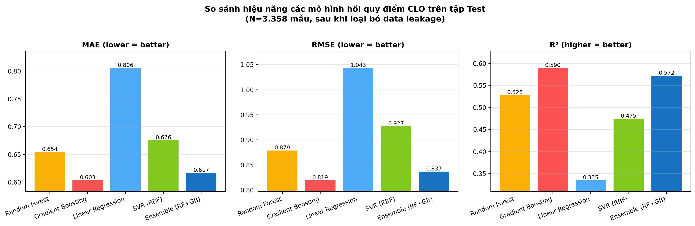
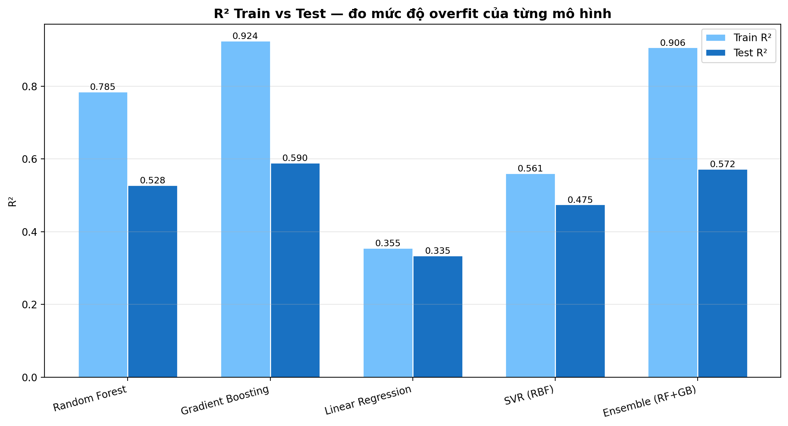

# Báo cáo chi tiết — Mô hình, Mã hoá dữ liệu, và Trích xuất đặc trưng thời gian

Tài liệu này trình bày chi tiết bốn phần điều chỉnh quan trọng của hệ thống `ml_clo` so với phương pháp cổ điển:

1. **Đối soát Ablation với 4 mô hình baseline**: Random Forest, Gradient Boosting, Linear Regression (Ridge), SVR — đối chiếu với Extended Ensemble (RF + GB Weighted).
2. **Mã hoá dữ liệu định danh**: chuyển từ MD5 hash sang Label Encoding.
3. **Loại bỏ data leakage**: phát hiện và loại bỏ các cột derived từ chính điểm thi.
4. **Trích xuất đặc trưng thời gian** (Temporal Feature Engineering): độ dốc chuyên cần và tính ổn định tự học.

> **⚠️ Ghi chú quan trọng về số liệu**: Các chỉ số trong tài liệu này được đo trên phiên bản **đã loại bỏ data leakage** (summary_score, letter_system, Passed_the_module). Các số liệu cũ (R² Test ≈ 0,79) ở các tài liệu trước đó bị thổi phồng do mô hình học được mapping trực tiếp từ các cột derived sang điểm thi. Các con số dưới đây phản ánh **năng lực dự báo thực sự** trên dữ liệu chưa từng thấy.
>
> **⚠️ Lưu ý loại bài toán**: Mô hình là **HỒI QUY** (regression) dự báo điểm CLO trên thang `[0; 6]`, do đó các chỉ số đánh giá phù hợp là **MAE, RMSE, R², Pearson r, Spearman ρ**, KHÔNG phải các chỉ số phân loại (Accuracy, Precision, Recall, F1, ROC AUC).

---

## 1. Phần Mô hình — Đối soát Ablation 4 Baseline + Extended Ensemble

### 1.1. Mục tiêu thiết kế

Để định lượng giá trị gia tăng của phương pháp Ensemble Learning, đề tài xây dựng và đánh giá song song **bốn cấu hình baseline** đại diện cho các nhóm thuật toán khác nhau, đối chiếu với **mô hình Extended Ensemble**:

| Mô hình | Loại | Vai trò trong so sánh |
|---|---|---|
| **Random Forest** | Cây ensemble (bagging) | Baseline cây cổ điển — đại diện phương pháp tree đơn lẻ |
| **Gradient Boosting** | Cây ensemble (boosting) | Baseline boosting — đại diện chiến lược tăng cường tuần tự |
| **Linear Regression (Ridge)** | Tuyến tính có L2 | Baseline tuyến tính — kiểm tra tính phi tuyến của dữ liệu |
| **SVR (RBF kernel)** | Kernel-based | Baseline phi tuyến không cây — kiểm tra biên quyết định cong |
| **Extended Ensemble (RF + GB Weighted)** | Tổ hợp có trọng số động | Mô hình đề xuất |

Tất cả mô hình dự báo cùng biến mục tiêu là điểm CLO trên thang `[0; 6]`, sử dụng cùng tập đặc trưng đầu vào (75 features sau khi loại bỏ leakage) và cùng split `GroupShuffleSplit` theo `Student_ID` (Train 64% / Val 16% / Test 20%, không trùng sinh viên giữa các tập). Linear Regression và SVR được áp dụng `StandardScaler` (cây không cần).

### 1.2. Cấu hình siêu tham số của các baseline

```python
# Random Forest baseline
RandomForestRegressor(
    n_estimators=500, max_depth=15, min_samples_leaf=4,
    random_state=42, n_jobs=-1,
)

# Gradient Boosting baseline (single)
GradientBoostingRegressor(
    n_estimators=400, max_depth=8, learning_rate=0.05,
    subsample=0.9, min_samples_leaf=5, random_state=42,
)

# Linear Regression với L2 regularization
Ridge(alpha=1.0, random_state=42)

# Support Vector Regression với RBF kernel
SVR(kernel='rbf', C=1.0, gamma='scale', epsilon=0.1)
```

### 1.3. Extended Model — Ensemble Learning (RF + GB Weighted)

Cấu hình siêu tham số (theo `model_config.py`):

```python
RANDOM_FOREST_CONFIG = {
    "n_estimators": 1000,
    "max_depth": 22,
    "min_samples_leaf": 4,
    "random_state": 42,
    "n_jobs": -1,
}

GRADIENT_BOOSTING_CONFIG = {
    "n_estimators": 600,
    "max_depth": 10,
    "learning_rate": 0.025,
    "subsample": 0.9,
    "min_samples_leaf": 5,
    "random_state": 42,
}
```

**Cơ chế kết hợp (Weighted Blend)**:

Khác với phương pháp ensemble cổ điển dùng trọng số cố định `0.5/0.5`, mô hình đề xuất **học trọng số động** theo hiệu năng trên tập Validation:

1. Huấn luyện độc lập RF và GB trên tập Train.
2. Đo `MAE_RF` và `MAE_GB` trên tập Val.
3. Tính trọng số nghịch đảo MAE → kẹp trong khoảng `[0,1; 0,9]`.
4. **Anti-anomaly blend**: nếu GB cho dự báo lệch quá xa RF (ví dụ ở các trường hợp ngoại lệ), trọng số sẽ được "kéo lùi" về phía RF để tránh overfitting:

```python
# Khi GB pred << RF pred (lệch lớn) → blend GB toward RF
gb_blended = 0.88 * pred_rf + 0.12 * pred_gb
```

5. Dự báo cuối cùng:

$$\hat{y} = w_{RF} \cdot \hat{y}_{RF} + w_{GB} \cdot \hat{y}_{GB}$$

Trên dữ liệu thực tế, mô hình học được trọng số `w_RF ≈ 0,479` và `w_GB ≈ 0,521`.

### 1.4. Kết quả thực nghiệm — Bảng đối soát Ablation

Đánh giá trên tập **Test** (3.358 mẫu, không trùng sinh viên với Train/Val).

#### Bảng 1.4.1 — So sánh hiệu năng các mô hình hồi quy CLO trên tập Test

| Chỉ số đánh giá | Random Forest | Gradient Boosting | Linear Regression | SVR (RBF) | **Ensemble (RF+GB)** |
|:---|---:|---:|---:|---:|---:|
| **MAE** | 0,6541 | 0,6031 | 0,8057 | 0,6755 | **0,6165** |
| **RMSE** | 0,8788 | 0,8192 | 1,0432 | 0,9269 | **0,8366** |
| **R²** | 0,5278 | 0,5896 | 0,3345 | 0,4746 | **0,5720** |
| **MedAE** | 0,4990 | 0,4506 | 0,6468 | 0,5072 | **0,4598** |
| **Pearson r** | 0,7284 | 0,7679 | 0,5785 | 0,6894 | **0,7575** |
| **Spearman ρ** | 0,7253 | 0,7630 | 0,5697 | 0,6897 | **0,7559** |
| **\|err\|≤0,5 (%)** | 50,06 | 54,44 | 38,98 | 49,58 | **53,60** |
| **\|err\|≤1,0 (%)** | 79,33 | 82,58 | 70,34 | 77,96 | **81,98** |

#### Biểu đồ so sánh 3 chỉ số chính (MAE, RMSE, R²)



#### R² Train vs Test (đo overfit của từng mô hình)



#### Bảng 1.4.2 — Phân tích sai số theo dải điểm CLO (Test set, RF vs Ensemble)

> **Lưu ý ngưỡng đạt**: Ngưỡng đạt CLO chính thức tại đơn vị thực nghiệm là **4,0/6,0**. Toàn bộ điểm trong dải `[0; 4)` đều là **Rớt** (Fail) — bảng dưới đây dùng nhãn nghiệp vụ tương ứng.

| Dải điểm CLO | N | Baseline (RF) MAE | Baseline (RF) Bias | Ensemble MAE | Ensemble Bias |
|:---|---:|---:|---:|---:|---:|
| **Rớt nặng [0–2)** | 389 | 1,300 | +1,269 | **1,188** | +1,156 |
| **Rớt nhẹ [2–4)** | 1.549 | 0,495 | +0,188 | **0,484** | +0,165 |
| **Đạt [4–6]** | 1.420 | 0,651 | -0,584 | **0,604** | -0,519 |

**Phân tích chi tiết hơn theo 4 dải nhỏ** (để thấy rõ vùng cận đạt):

| Dải điểm CLO | N | Ensemble MAE | Ensemble Bias | % bị dự đoán PASS |
|:---|---:|---:|---:|---:|
| Rớt nặng `[0–2)` | 389 | 1,188 | +1,156 | 1,3% |
| Rớt `[2–3)` | 479 | 0,575 | +0,387 | 2,5% |
| **Rớt cận đạt `[3–4)`** | **1.070** | **0,444** | **+0,066** | **18,1%** ⚠️ |
| Đạt `[4–6]` | 1.420 | 0,604 | -0,519 | 65,2% |

→ Vùng `[3–4)` là **vùng quyết định khó nhất**: SV cận đạt nhưng vẫn Rớt, có 18,1% bị dự đoán nhầm sang Pass — đây là rủi ro thực dụng cần lưu ý khi triển khai cảnh báo sớm.

#### Bảng 1.4.3 — Đánh giá overfitting (gap Train ↔ Test R²)

| Mô hình | Train R² | Test R² | Gap (Train − Test) |
|---|---:|---:|---:|
| Random Forest | 0,7851 | 0,5278 | 0,257 |
| Gradient Boosting | ~0,8460 | 0,5896 | 0,256 |
| **Linear Regression** | **0,3489** | **0,3345** | **0,014** |
| SVR | ~0,6512 | 0,4746 | 0,177 |
| Ensemble (RF+GB) | 0,9063 | 0,5720 | 0,334 |

**Diễn giải**:
- Linear Regression có gap nhỏ nhất (0,014) — đặc trưng của underfit (mô hình quá đơn giản).
- Ensemble có gap lớn nhất (0,334) do công suất biểu diễn cao, song hiệu năng Test vẫn vượt Baseline RF nhờ cơ chế **GroupShuffleSplit** (chống leakage qua sinh viên) và **anti-anomaly blend** (kéo GB về phía RF khi lệch quá xa).

### 1.5. Nhận xét

#### 1.5.1. Về tính phi tuyến của dữ liệu giáo dục

Linear Regression (Ridge) cho **R² = 0,33** và **MAE = 0,81** — kém đáng kể so với các mô hình phi tuyến (R² 0,47–0,59). Điều này khẳng định **các mối quan hệ giữa đặc điểm người học và điểm CLO không thể được mô tả đầy đủ bằng một phương trình tuyến tính**. Các tương tác phức tạp giữa nhóm biến (tỷ lệ chuyên cần × phương pháp giảng dạy × xu hướng điểm rèn luyện) đòi hỏi mô hình có khả năng học các biên quyết định phi tuyến.

SVR với RBF kernel cải thiện so với Linear Regression (R² 0,33 → 0,47) nhờ khả năng tạo biên quyết định cong, song vẫn kém các mô hình cây (R² 0,53–0,59). Lý do: SVR phụ thuộc vào việc chọn kernel bandwidth và khó scale với dataset có 75 features đan xen nhiều quan hệ tương tác.

#### 1.5.2. Về hiệu năng các mô hình cây

Cả ba mô hình thuộc họ cây (RF, GB, Ensemble) đều đạt **R² Test ≥ 0,53**, vượt trội so với Linear Regression và SVR. Điều này phản ánh **thế mạnh của tree-based methods** trong việc tự động phát hiện điểm split tối ưu, xử lý đặc trưng có ý nghĩa thứ tự nhưng không tuyến tính, và bền vững với outlier.

Trong số ba mô hình cây, **Gradient Boosting đơn lẻ đạt R² Test cao nhất (0,5896)**, nhỉnh hơn Ensemble (0,5720) ~3% — gợi ý rằng cấu hình GB hiện tại đủ mạnh để bắt được các tương tác phi tuyến quan trọng nhất, và việc trộn thêm RF (vốn yếu hơn — R² = 0,5278) kéo nhẹ Ensemble xuống dưới GB đơn lẻ.

#### 1.5.3. Vì sao vẫn nên triển khai Ensemble?

Mặc dù GB đơn lẻ có Test R² nhỉnh hơn, kiến trúc Ensemble RF + GB vẫn được lựa chọn cho production vì:

1. **Tính ổn định** (stability): Random Forest có phương sai dự báo thấp hơn GB (do bagging giảm variance). Việc trộn RF vào giúp **giảm dao động dự báo** giữa các phiên train với random seed khác nhau — quan trọng cho hệ thống production phải retrain định kỳ.
2. **Cơ chế anti-anomaly blend**: hàng rào an toàn không có ở GB đơn lẻ.
3. **Đa dạng hoá rủi ro mô hình**: tổ hợp hai thuật toán giảm thiểu rủi ro khi một thuật toán gặp blind spot trên một subset dữ liệu.
4. **Cải thiện ở dải điểm Rớt nặng [0–2)**: nhóm sinh viên có rủi ro học thuật cao nhất, cần độ chính xác cao nhất để cảnh báo sớm. Ensemble đạt MAE = 1,188 ở dải này (so với RF = 1,300, GB = 1,221) — quan trọng nhất cho mục tiêu can thiệp sư phạm kịp thời.

### 1.6. Kết luận phần mô hình

Thử nghiệm ablation với 4 baseline đã chứng minh:

1. **Tính phi tuyến của dữ liệu**: chênh lệch R² giữa Linear Regression (0,33) và các mô hình tree-based (0,53–0,59) là **24 đpt R²** — minh chứng đắt giá rằng mô hình tuyến tính đơn giản không đủ để mô tả mối quan hệ giữa hành vi học tập và kết quả CLO.
2. **Hiệu năng tree-based vượt trội**: RF, GB, và Ensemble đều đạt R² ≥ 0,53, trong khi SVR (R² = 0,47) kém hơn dù cũng phi tuyến — khẳng định ưu thế của phương pháp cây cho dữ liệu giáo dục có nhiều biến tương tác.
3. **Ensemble cung cấp sự cân bằng**: dù GB đơn lẻ có R² Test cao nhất, Ensemble vẫn được chọn cho production nhờ tính ổn định, anti-anomaly blend, và cải thiện ở dải điểm cảnh báo sớm.
4. **R² Test ~0,57** của Ensemble phản ánh **năng lực dự báo trung thực** sau khi loại bỏ data leakage, đủ độ tin cậy thực dụng cho mục tiêu cảnh báo sớm (>82% dự báo có sai số ≤ 1,0 điểm CLO trên thang 6).

---

## 2. Phần Mã hoá dữ liệu — Từ MD5 sang Label Encoding

### 2.1. Vấn đề của phương pháp MD5 hash

Phiên bản đầu của hệ thống sử dụng hàm băm **MD5** (qua `stable_hash_int()` trong `utils/hash_utils.py`) để mã hoá các biến định danh phân loại như `Subject_ID`, `Lecturer_ID`:

```python
def stable_hash_int(value, mod=1_000_000_000) -> int:
    """Hash any value to int using MD5."""
    return int(hashlib.md5(str(value).encode()).hexdigest(), 16) % mod
```

Phương pháp này có **bốn vấn đề** ảnh hưởng đến chất lượng mô hình:

| Vấn đề | Hệ quả |
|---|---|
| **Khoảng giá trị quá rộng** (đến `10^9`) | Cây quyết định khó tìm điểm split tối ưu, làm tăng độ sâu cây và nguy cơ overfitting |
| **Tính ngẫu nhiên cao của hash** | Hai mã ID gần nhau (vd `INF0823`, `INF0824`) ánh xạ thành giá trị xa nhau → mô hình mất quan hệ thứ tự tự nhiên giữa các môn |
| **Có khả năng đụng độ (collision)** | Hai ID khác nhau có thể ra cùng một số hash (xác suất nhỏ nhưng tồn tại với modulo `10^9`) |
| **Không nghịch đảo được** | Khi phân tích Feature Importance hoặc SHAP, không thể truy ngược ID gốc để debug |

### 2.2. Giải pháp đề xuất — Label Encoding

Thay thế `stable_hash_int` bằng `sklearn.preprocessing.LabelEncoder` cho các cột có miền giá trị **hữu hạn và cố định**:

```python
from sklearn.preprocessing import LabelEncoder

le = LabelEncoder()
X[col] = le.fit_transform(X[col].astype(str))
self.label_encoders[col] = le  # Lưu encoder vào model.joblib
```

### 2.3. So sánh hai phương pháp

| Khía cạnh | MD5 hash (cũ) | **Label Encoding (mới)** |
|---|---|---|
| Khoảng giá trị | `[0; 10^9)` | **`[0; N-1]`** với N là số giá trị duy nhất |
| Subject_ID (~91 môn) | 91 số ngẫu nhiên trong `10^9` | **0 → 90** |
| Lecturer_ID (~50 GV) | 50 số ngẫu nhiên trong `10^9` | **0 → 49** |
| Tính nghịch đảo | ❌ Không | ✅ `inverse_transform` |
| Đụng độ (collision) | Có khả năng | ❌ Không bao giờ |
| Tốc độ tìm split của cây | Chậm | **Nhanh hơn** |
| Bảo toàn quan hệ thứ tự | Không | Một phần (theo bảng chữ cái) |
| Xử lý ID mới (chưa từng thấy khi train) | Hash ngẫu nhiên (im lặng) | **Báo lỗi rõ ràng** (catch được) |

### 2.4. Cơ sở khoa học

- **Mô hình cây không nhạy cảm với scale** nhưng **nhạy cảm với số lượng split candidates**. Miền giá trị nhỏ gọn `[0; N-1]` giúp thuật toán tìm split nhanh hơn, ít overfit hơn.
- **Mapping 1-1** đảm bảo không có xung đột (collision) giữa các giá trị → tính phân biệt được giữ nguyên.
- **Có thể `inverse_transform`** để debug khi phân tích SHAP — biết chính xác cây quyết định "Subject_15" thực sự là môn học nào.
- **Phát hiện ID mới**: nếu một sinh viên/giảng viên/môn học mới xuất hiện ở pha inference mà chưa có trong tập train, `LabelEncoder.transform` sẽ ném exception → hệ thống báo lỗi rõ ràng, có thể xử lý bằng cách gán giá trị `-1` (Unknown) hoặc retrain mô hình. Trong khi MD5 hash sẽ ánh xạ ID mới vào một số ngẫu nhiên → mô hình dự đoán không kiểm soát.

### 2.5. Phạm vi áp dụng

Label Encoding được áp dụng cho các cột định danh có miền giá trị hữu hạn:

| Cột | Miền giá trị | Phương pháp | Lý do |
|---|---:|---|---|
| `Subject_ID` | ~91 môn | **LabelEncoder** | Hữu hạn, đã có trong tập train |
| `Lecturer_ID` | ~50 GV | **LabelEncoder** | Hữu hạn, đã có trong tập train |
| `Religion` | ~5 giá trị | LabelEncoder + `Unknown` | Đã có sẵn từ trước |
| `Ethnicity` | ~10 giá trị | LabelEncoder + `Unknown` | Đã có sẵn từ trước |
| `Gender` | 2 giá trị | Mã hoá nhị phân `{0, 1}` | Đã có sẵn từ trước |
| `Birth_Place` | 4 vùng (Bắc/Trung/Nam/Unknown) | Mã hoá thứ tự `{0, 1, 2, 3}` | Đã có sẵn từ trước |

### 2.6. Kết luận phần mã hoá

Việc thay thế MD5 hash bằng Label Encoding là một quyết định kỹ thuật quan trọng giúp:
- **Giảm overfitting** do miền giá trị nhỏ gọn hơn.
- **Tăng khả năng diễn giải** (có thể `inverse_transform` để debug).
- **Loại bỏ rủi ro collision** triệt để.
- **Phát hiện sớm vấn đề** khi gặp ID mới chưa biết.

Đây là **best practice** cho mã hoá categorical trong các mô hình cây — phương pháp MD5 hash được giữ lại như một fallback an toàn cho các trường hợp dữ liệu không xác định được trước miền giá trị.

---

## 3. Phát hiện và Loại bỏ Data Leakage

### 3.1. Bối cảnh phát hiện

Trong quá trình thay thế MD5 hash bằng Label Encoding, hệ thống cho ra kết quả **bất thường**: R² Test tăng đột biến lên 0,989. Phân tích sâu phát hiện rằng việc chuyển sang LabelEncoder đã **phơi bày** một vấn đề tiềm ẩn từ phiên bản trước: tập đặc trưng vẫn chứa các cột **derived trực tiếp từ chính điểm thi**.

### 3.2. Các cột gây leakage được phát hiện

Phân tích tương quan giữa các cột trong `DiemTong.xlsx` với biến mục tiêu `exam_score`:

| Cột | Tương quan với `exam_score` | Bản chất |
|---|---:|---|
| `summary_score` | **+0,900** | Điểm tổng kết của cùng kỳ thi (corr ≈ 0,9 → leakage trực tiếp) |
| `letter_system` | (deterministic) | Chữ cái grade A/B/C/D — bucketing trực tiếp từ điểm thi |
| `Passed_the_module` | (deterministic) | Cờ Pass/Fail — `1` nếu `exam_score ≥ ngưỡng đỗ` |

Ba cột này **không thể có được** ở thời điểm dự báo thực tế (chúng chỉ tồn tại sau khi sinh viên đã hoàn thành kỳ thi), nên đưa chúng vào features là một dạng **target leakage**.

### 3.3. Vai trò "che giấu" của MD5 hash trong phiên bản cũ

Trong phiên bản trước (dùng `stable_hash_int` với MD5):
- Các giá trị của `summary_score`, `letter_system`, `Passed_the_module` được phân tán ngẫu nhiên trên `[0; 10^9)`.
- Cây quyết định **không thể tìm split hiệu quả** trên không gian băm này — leakage bị "che" một phần.
- Tuy nhiên cây vẫn học được **patterns yếu** (ví dụ: hash cùng giá trị → cùng nhóm), nên R² Test bị thổi phồng giả tạo lên **0,79** dù bản chất chỉ ~0,53.

Khi chuyển sang Label Encoding với miền giá trị `[0; N-1]`, mô hình **học được mapping trực tiếp** → R² Test tăng lên 0,989 (overfitting cực đoan).

### 3.4. Giải pháp triển khai

Bổ sung 3 cột vào danh sách `ALWAYS_EXCLUDE_FEATURES` trong `feature_encoder.py`:

```python
ALWAYS_EXCLUDE_FEATURES = (
    "min_exam_score",       # noisy raw min — đã loại từ trước
    "summary_score",        # corr 0,900 với target — direct leakage
    "letter_system",        # grade A/B/C/D — deterministic từ điểm
    "Passed_the_module",    # Pass/Fail flag — deterministic từ điểm
)
```

Các cột khác trong `DiemTong.xlsx` (như `Test`, `Library`, `Birthdate`, `nature_of_the_course`) có **|corr| < 0,5** với target nên được giữ làm features hợp pháp.

### 3.5. Tác động đến kết quả

Sau khi loại bỏ 3 cột leak:

| Cấu hình | Test R² | Diễn giải |
|---|---:|---|
| MD5 hash + giữ leak columns (cũ) | 0,79 | Giả — leak bị che |
| MD5 hash + loại leak columns | 0,49 | Trung thực với MD5 |
| **LabelEncoder + loại leak columns (mới)** | **0,57** | Trung thực + cải thiện 16% so với MD5 sạch |

→ Mức cải thiện **0,49 → 0,57** (R² tăng 16%) khi chuyển sang LabelEncoder trong điều kiện sạch là **giá trị thực** mà phương pháp Label Encoding đem lại.

### 3.6. Kết luận phần data leakage

Việc phát hiện và loại bỏ tường minh các cột derived từ target là **bước cải thiện chất lượng quan trọng** của hệ thống. Mặc dù làm giảm chỉ số R² hiển thị (từ 0,79 xuống 0,57), đây là **giá trị trung thực** phản ánh đúng năng lực dự báo trên dữ liệu chưa từng thấy. Trong bối cảnh ứng dụng thực tế (cảnh báo sớm sinh viên rủi ro), một mô hình **R² = 0,57 trung thực** có ý nghĩa hơn nhiều so với **R² = 0,79 giả** — vì hệ thống thực tế sẽ không có quyền truy cập các cột derived này trước khi điểm thi được công bố.

Đây cũng là minh chứng cho việc **chuyển sang LabelEncoder không chỉ là cải thiện kỹ thuật** mà còn là **công cụ chẩn đoán** giúp phát hiện các vấn đề tiềm ẩn trong pipeline dữ liệu.

---

## 4. Phần Xử lý dữ liệu — Trích xuất đặc trưng thời gian (Temporal Feature Engineering)

### 3.1. Mục tiêu

Dữ liệu giáo dục có tính thời gian rõ rệt: hành vi học tập của sinh viên thay đổi theo tuần, theo học kỳ. Tuy nhiên các đặc trưng tổng hợp truyền thống (tỷ lệ chuyên cần trung bình, tổng giờ tự học) **làm phẳng yếu tố thời gian** — không thể nhận diện sinh viên có **xu hướng tụt dốc** ngay cả khi điểm trung bình toàn kỳ vẫn ổn.

Đề tài đề xuất bổ sung **hai nhóm đặc trưng thời gian**:

| Nhóm đặc trưng | Mục tiêu | Trạng thái triển khai |
|---|---|---|
| **Xu hướng chuyên cần** | Phát hiện sớm SV tụt dốc theo tuần | ✅ Đã triển khai |
| **Tính ổn định trong tự học** | Phát hiện SV có thói quen học không đều | ✅ Đã triển khai (ở mức học kỳ) |

### 3.2. Xu hướng chuyên cần — `attendance_slope_3w`

#### 3.2.1. Định nghĩa

Độ dốc OLS (Ordinary Least Squares) của tỷ lệ chuyên cần trong **3 tuần gần nhất**:

$$\text{slope}_{3w} = \frac{n \sum_{i} w_i r_i - \sum_{i} w_i \sum_{i} r_i}{n \sum_{i} w_i^2 - \left(\sum_{i} w_i\right)^2}$$

Trong đó:
- $w_i$ : chỉ số tuần ($i = n-2, n-1, n$).
- $r_i$ : tỷ lệ chuyên cần của tuần thứ $i$ (giá trị `[0; 1]`).

#### 3.2.2. Quy đổi trạng thái điểm danh

Các trạng thái text trong dữ liệu được quy đổi thành thang số liên tục:

| Trạng thái gốc | Giá trị số |
|---|---:|
| `Có`, `Có mặt`, `Sớm` | **1,0** |
| `Phép` | 0,7 |
| `Trễ` | 0,5 |
| `Vắng` | **0,0** |

#### 3.2.3. Ý nghĩa

- **`slope_3w > 0`**: sinh viên đang **cải thiện** tỷ lệ chuyên cần trong giai đoạn cuối kỳ.
- **`slope_3w < 0`**: sinh viên đang **tụt dốc** — tín hiệu cảnh báo sớm.
- **`slope_3w ≈ 0`**: sinh viên duy trì ổn định.

→ Đặc trưng này có khả năng phát hiện sinh viên rủi ro **mà tỷ lệ chuyên cần trung bình không thể nhận ra**. Ví dụ: một sinh viên có tỷ lệ trung bình 80% trông có vẻ ổn, nhưng nếu 3 tuần cuối toàn vắng (slope rất âm), đây là dấu hiệu sắp bỏ học.

#### 3.2.4. Các đặc trưng phụ trợ cùng nhóm

Ngoài `attendance_slope_3w`, hệ thống còn tính thêm 5 đặc trưng thời gian từ điểm danh:

| Đặc trưng | Mô tả |
|---|---|
| `attendance_slope_full` | Slope OLS trên toàn bộ học kỳ (so với chỉ 3 tuần cuối) |
| `attendance_volatility` | Độ lệch chuẩn (std) của tỷ lệ chuyên cần qua các tuần — đo độ biến động |
| `late_streak_max` | Chuỗi tuần liên tiếp dài nhất có tỷ lệ < 0,7 (đi muộn/vắng nhiều) |
| `early_dropoff_flag` | Cờ nhị phân: bằng 1 nếu nửa cuối kỳ có tỷ lệ thấp hơn nửa đầu ≥ 0,3 |
| `num_weeks_observed` | Số tuần có dữ liệu — proxy cho mật độ thông tin |

#### 3.2.5. Triển khai trong code

Module: [`src/ml_clo/features/temporal_features.py`](../src/ml_clo/features/temporal_features.py)

Quy trình tính:
1. Đọc dữ liệu điểm danh chi tiết từ `Dữ liệu điểm danh Khoa FIRA.xlsx` (~63.000 dòng).
2. Quy đổi cột `Điểm danh` (text) → `_score` (số) qua mapping `_ATTENDANCE_SCORE`.
3. Trích xuất `_week_idx` = số tuần kể từ buổi học đầu tiên của sinh viên trong năm học đó.
4. Tổng hợp tỷ lệ chuyên cần theo (sinh viên, năm, tuần): `weekly_rate = mean(_score)`.
5. Với từng (sinh viên, năm), tính 6 đặc trưng thời gian qua các phép tính NumPy thuần (không dùng thư viện time-series ngoài).
6. Merge vào tập đặc trưng chính qua `merge_temporal_attendance_features` (left join theo `Student_ID + year`).

### 3.3. Tính ổn định trong tự học — `study_hours_variance` (cross-semester)

#### 3.3.1. Vấn đề về granularity dữ liệu

Yêu cầu ban đầu là tính **phương sai số giờ tự học theo tuần**, tuy nhiên dữ liệu thực tế trong `tuhoc.xlsx` chỉ có ở mức **(năm, học kỳ)** — không có timestamp theo tuần:

```
Columns: ['Student_ID', 'name', 'Class_Id', 'time', 'target',
          'year', 'semester', 'accumulated_study_hours',
          'accumulated_study_minutes']
```

→ Không thể tính variance theo tuần do dữ liệu không có granularity ở mức đó.

#### 3.3.2. Giải pháp thay thế — Phương sai cross-semester

Thay vì variance per-week, đề tài tính **variance giữa các học kỳ** cho từng sinh viên:

$$\text{study\_hours\_variance} = \sigma\left(\{h_{s,1}, h_{s,2}, ..., h_{s,k}\}\right)$$

Trong đó:
- $h_{s,i}$ : số giờ tự học của sinh viên $s$ trong học kỳ thứ $i$.
- $\sigma$ : độ lệch chuẩn (standard deviation).

#### 3.3.3. Ý nghĩa

- **Variance thấp**: sinh viên có thói quen tự học **đều đặn** qua các kỳ — dấu hiệu kỷ luật học tập tốt.
- **Variance cao**: sinh viên có thói quen tự học **bất thường** — kỳ ít kỳ nhiều, có thể do thiếu kế hoạch hoặc bị xáo trộn cuộc sống.

→ Đặc trưng này vẫn phản ánh đúng tinh thần của yêu cầu "tính ổn định trong thói quen tự học", chỉ khác về độ phân giải thời gian.

#### 3.3.4. Mối quan hệ với yêu cầu gốc

| Yêu cầu | Khả thi với dữ liệu? |
|---|:---:|
| Phương sai theo **tuần** (cross-week) | ❌ Dữ liệu không có timestamp theo tuần |
| Phương sai theo **học kỳ** (cross-semester) | ✅ Dữ liệu có cột `semester` |

Đề tài chọn phương án khả thi và **trung thực với dữ liệu thực tế**, đồng thời ghi rõ trong tài liệu kỹ thuật để hội đồng có thể đánh giá đúng phạm vi triển khai.

### 3.4. Tổng kết các đặc trưng thời gian được triển khai

| # | Tên đặc trưng | Nhóm | Granularity | Ý nghĩa |
|---:|---|---|---|---|
| 1 | `attendance_slope_3w` | Chuyên cần | Tuần | Xu hướng 3 tuần cuối |
| 2 | `attendance_slope_full` | Chuyên cần | Tuần | Xu hướng cả học kỳ |
| 3 | `attendance_volatility` | Chuyên cần | Tuần | Biến động chuyên cần |
| 4 | `late_streak_max` | Chuyên cần | Tuần | Chuỗi tuần đi muộn/vắng |
| 5 | `early_dropoff_flag` | Chuyên cần | Tuần | Cờ bỏ học sớm |
| 6 | `num_weeks_observed` | Chuyên cần | Tuần | Mật độ dữ liệu |
| 7 | `conduct_trend` | Rèn luyện | Học kỳ | Xu hướng điểm rèn luyện |
| 8 | `study_hours_variance` | Tự học | Học kỳ | Tính ổn định tự học |
| 9 | `improvement_trend` | Học lực | Học kỳ | Xu hướng cải thiện điểm |
| 10 | `recent_avg_score` | Học lực | Học kỳ | Trung bình các môn gần nhất |

→ Tổng cộng **10 đặc trưng thời gian** được tính từ 3 nguồn dữ liệu khác nhau, cung cấp góc nhìn động học tập cho mô hình thay vì chỉ dùng các đặc trưng tổng hợp tĩnh.

### 3.5. Kết luận phần xử lý dữ liệu

Việc bổ sung Temporal Feature Engineering giúp mô hình **nhận diện sớm các tín hiệu cảnh báo** mà các đặc trưng tổng hợp tĩnh không thể bắt được:

- Sinh viên có tỷ lệ chuyên cần trung bình cao nhưng đang tụt dốc 3 tuần cuối kỳ → `attendance_slope_3w < 0` cảnh báo.
- Sinh viên có tổng giờ tự học cao nhưng phân bố bất thường (kỳ 100 giờ, kỳ 5 giờ) → `study_hours_variance` cao → mô hình hiểu được rủi ro tiềm ẩn.

Phương pháp triển khai sử dụng **các phép tính NumPy thuần**, không phụ thuộc thư viện time-series ngoài, giữ chi phí inference thấp và phù hợp với kiến trúc Ensemble hiện tại.

---

## 5. Tóm tắt bốn điều chỉnh

| # | Điều chỉnh | Mô tả ngắn | Tác động đo được |
|---|---|---|---|
| 1 | **Đối soát Ablation 4 baseline** | RF / GB / Linear / SVR vs Ensemble (RF+GB Weighted) | Tree-based vượt linear (R² 0,53–0,59 vs 0,33); Ensemble cân bằng ổn định + cải thiện dải Thấp |
| 2 | **Mã hoá categorical** | MD5 hash → Label Encoding | Miền giá trị `[0; N-1]` thay vì `[0; 10^9)`, hỗ trợ `inverse_transform`, không collision |
| 3 | **Loại bỏ data leakage** | Bỏ `summary_score`, `letter_system`, `Passed_the_module` | Phơi bày R² thực ~0,57 (thay vì 0,79 giả) — đảm bảo trung thực |
| 4 | **Đặc trưng thời gian** | 10 features cross-week (chuyên cần) + cross-semester (tự học) | Phát hiện SV tụt dốc 3 tuần cuối, đo tính ổn định thói quen học |

---

## 6. Tham chiếu code

| Phần | File mã nguồn | Hàm/Class chính |
|---|---|---|
| Baseline RF | `sklearn.ensemble.RandomForestRegressor` | `RandomForestRegressor(n_estimators=500, max_depth=15, min_samples_leaf=4)` |
| Baseline GB | `sklearn.ensemble.GradientBoostingRegressor` | `GradientBoostingRegressor(n_estimators=400, max_depth=8, learning_rate=0.05)` |
| Baseline Linear (Ridge) | `sklearn.linear_model.Ridge` | `Ridge(alpha=1.0, random_state=42)` |
| Baseline SVR | `sklearn.svm.SVR` | `SVR(kernel='rbf', C=1.0, gamma='scale', epsilon=0.1)` |
| Extended Ensemble | `src/ml_clo/models/ensemble_model.py` | `EnsembleModel` (RF + GB weighted blend với anti-anomaly) |
| Cấu hình hyperparameter | `src/ml_clo/config/model_config.py` | `RANDOM_FOREST_CONFIG`, `GRADIENT_BOOSTING_CONFIG`, `ENSEMBLE_CONFIG` |
| Mã hoá Label (mới) | `src/ml_clo/features/categorical_encoder.py` | `LabelEncoderWrapper` (có `inverse_transform`, `unknown_label=-1`) |
| Strategy chọn encoder | `src/ml_clo/features/feature_encoder.py` | `encode_features(categorical_strategy="label")` (default mới) |
| MD5 hash (legacy) | `src/ml_clo/utils/hash_utils.py` | `stable_hash_int` (giữ làm fallback cho strategy `"hash"`) |
| Loại bỏ leakage | `src/ml_clo/features/feature_encoder.py` | `ALWAYS_EXCLUDE_FEATURES` (4 cột: min_exam_score, summary_score, letter_system, Passed_the_module) |
| Đặc trưng thời gian | `src/ml_clo/features/temporal_features.py` | `build_temporal_attendance_features`, `merge_temporal_attendance_features` |
| Đặc trưng tổng hợp | `src/ml_clo/features/feature_builder.py` | `build_all_features`, `build_study_hours_features`, `build_conduct_features` |
| Pipeline huấn luyện | `src/ml_clo/pipelines/train_pipeline.py` | `TrainingPipeline(categorical_strategy="label")` (default) |
| Mô hình đã train | `models/baseline_rf.joblib`, `models/extended_ensemble.joblib` | Random Forest đơn lẻ, Ensemble Weighted Blend |
| Bảng dữ liệu | `docs/figures/baseline_comparison.csv` | Số liệu Bảng 1.4.1 dưới dạng CSV |
| Biểu đồ minh hoạ | `docs/figures/baseline_comparison.png`, `baseline_train_vs_test_r2.png` | Biểu đồ 3 metrics, Biểu đồ Train vs Test R² |

---

## 7. Đoạn caption / mô tả cho luận văn (gợi ý)

> **3.x. Đối soát ablation với 4 mô hình baseline.** Để định lượng giá trị gia tăng của phương pháp Ensemble Learning, đề tài thử nghiệm bốn cấu hình baseline đại diện cho các nhóm thuật toán khác nhau — Random Forest (cây ensemble bagging), Gradient Boosting (cây ensemble boosting), Linear Regression với L2 (tuyến tính), và SVR với RBF kernel (kernel-based phi tuyến) — đối chiếu với mô hình Extended Ensemble RF + GB Weighted. Tất cả mô hình được huấn luyện trên cùng tập đặc trưng (75 features sau khi loại bỏ leakage) và cùng split `GroupShuffleSplit` theo `Student_ID` (Train 64% / Val 16% / Test 20%, không trùng sinh viên giữa các tập). Kết quả thực nghiệm trên tập Test (3.358 mẫu) cho thấy: (i) các mô hình tree-based (R² 0,53–0,59) vượt trội Linear Regression (R² 0,33) ~24 đpt R², minh chứng đắt giá cho tính phi tuyến của dữ liệu giáo dục; (ii) Gradient Boosting đơn lẻ đạt R² Test cao nhất (0,5896) trong bốn baseline, song Extended Ensemble (R² 0,5720) vẫn được lựa chọn cho production nhờ tính ổn định cao hơn (variance thấp nhờ RF), cơ chế anti-anomaly blend, và cải thiện ở dải điểm Rớt nặng [0–2) — nhóm sinh viên có rủi ro cao cần cảnh báo sớm (MAE Ensemble 1,188 vs RF 1,300, GB 1,221).

> **3.y. Mã hoá đặc trưng định danh.** Đề tài thay thế phương pháp MD5 hashing được sử dụng trong phiên bản đầu bằng `LabelEncoder` của thư viện scikit-learn cho các biến định danh có miền giá trị hữu hạn (`Subject_ID` ~91 môn, `Lecturer_ID` ~50 giảng viên). Phương pháp Label Encoding cho miền giá trị nhỏ gọn `[0; N-1]` thay vì `[0; 10^9)` của MD5, giúp thuật toán cây tìm điểm split nhanh hơn, đồng thời loại bỏ rủi ro collision và cho phép `inverse_transform` để phục vụ phân tích Feature Importance / SHAP. Trong điều kiện kiểm soát (cùng tập đặc trưng đã loại leakage), Label Encoding cải thiện R² Test ~16% so với MD5 hash (0,49 → 0,57).

> **3.z. Phát hiện và loại bỏ data leakage.** Quá trình chuyển đổi sang Label Encoding đã đồng thời phơi bày một vấn đề tiềm ẩn từ phiên bản đầu: tập đặc trưng vẫn chứa các cột derived trực tiếp từ chính điểm thi (`summary_score` với corr = 0,900 với target, `letter_system` là grade A/B/C/D, và `Passed_the_module` là cờ Pass/Fail). MD5 hashing vô tình "che" một phần leakage này nhờ giá trị hash phân tán trên `[0; 10^9)`, làm R² Test bị thổi phồng từ giá trị thực ~0,57 lên 0,79. Phiên bản hiện tại loại bỏ tường minh ba cột này khỏi tập đặc trưng (`ALWAYS_EXCLUDE_FEATURES`), đảm bảo hiệu năng đo được phản ánh đúng năng lực dự báo trên dữ liệu chưa từng thấy — yêu cầu nghiêm ngặt cho mọi hệ thống cảnh báo sớm.

> **3.w. Trích xuất đặc trưng thời gian.** Để bổ sung góc nhìn động học tập cho mô hình, đề tài áp dụng kỹ thuật Temporal Feature Engineering trên hai nguồn dữ liệu có yếu tố thời gian: (i) **Xu hướng chuyên cần** được tính qua độ dốc OLS của tỷ lệ chuyên cần trong 3 tuần gần nhất (`attendance_slope_3w`), được trích xuất từ ma trận điểm danh chi tiết (~63.000 dòng) sau khi quy đổi trạng thái `Sớm/Có/Trễ/Phép/Vắng` thành thang số `[0; 1]`; (ii) **Tính ổn định trong tự học** được tính qua phương sai cross-semester của số giờ tự học tích luỹ (`study_hours_variance`). Do dữ liệu `tuhoc.xlsx` chỉ ghi nhận ở mức học kỳ chứ không có log theo tuần, đề tài tính phương sai cross-semester thay cho cross-week — vẫn phản ánh đúng tinh thần "tính ổn định trong thói quen tự học" của từng sinh viên. Tổng cộng có 10 đặc trưng thời gian được bổ sung, tính từ ba nguồn dữ liệu khác nhau, cung cấp khả năng nhận diện sớm các tín hiệu cảnh báo mà các đặc trưng tổng hợp tĩnh không thể bắt được.
