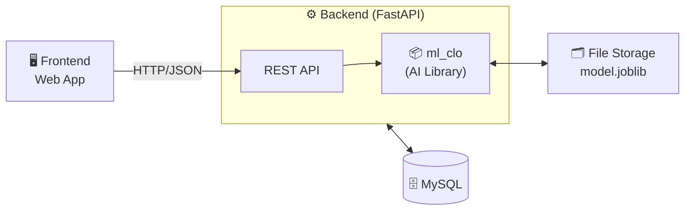
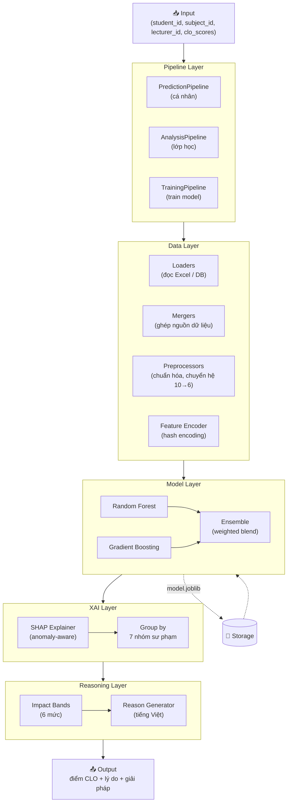

# Kiến trúc hệ thống

> Xem diagram: mở file này trong VS Code → nhấn `Cmd+Shift+V`  
> Cần extension **Markdown Preview Mermaid Support**  
> Hoặc copy code vào [mermaid.live](https://mermaid.live)

---

## 1. Kiến trúc tổng thể

| Thành phần | Vai trò |
| --- | --- |
| **Frontend** | Giao diện người dùng |
| **Backend (FastAPI)** | REST API + tích hợp ml_clo như library |
| **ml_clo** | Thư viện AI (predict, analyze, train) chạy bên trong backend |
| **MySQL** | Lưu dữ liệu sinh viên, điểm, kết quả dự đoán |
| **File Storage** | Lưu model đã train (`model.joblib`) |

---

## 2. Kiến trúc AI Model (ml_clo)

### 5 tầng bên trong ml_clo

| Tầng | Module | Vai trò |
| --- | --- | --- |
| **Pipeline** | `pipelines/` | Điều phối luồng: predict / analyze / train |
| **Data** | `data/` | Load, merge, chuẩn hóa, hash encode |
| **Model** | `models/` | RF + GB ensemble → dự đoán điểm CLO 0–6 |
| **XAI** | `xai/` | SHAP anomaly-aware → 7 nhóm sư phạm |
| **Reasoning** | `reasoning/` | Impact bands (6 mức) → lý do + giải pháp tiếng Việt |

### 7 nhóm sư phạm (SHAP grouping)

| Nhóm | Ý nghĩa |
| --- | --- |
| Tự học | Giờ tự học, tài liệu tự nghiên cứu |
| Chuyên cần | Tỷ lệ điểm danh |
| Rèn luyện | Điểm rèn luyện, hoạt động ngoại khóa |
| Học lực | Điểm thi, lịch sử học tập |
| Giảng dạy | Phương pháp giảng dạy (PPGD) |
| Đánh giá | Phương pháp đánh giá (PPDG) |
| Cá nhân | Nhân khẩu học (giới tính, địa phương) |

---

## Ghi chú tích hợp

- **ml_clo** cài vào backend như package Python: `pip install -e /path/to/modelAI`
- Backend đọc dữ liệu từ MySQL, chuẩn bị DataFrame rồi truyền vào pipeline
- `model.joblib` nên đặt trong object storage hoặc volume mount, không commit vào git
- Audit log (`logs/predictions.jsonl`) opt-in: gọi `set_audit_log_path(...)` khi khởi động backend
