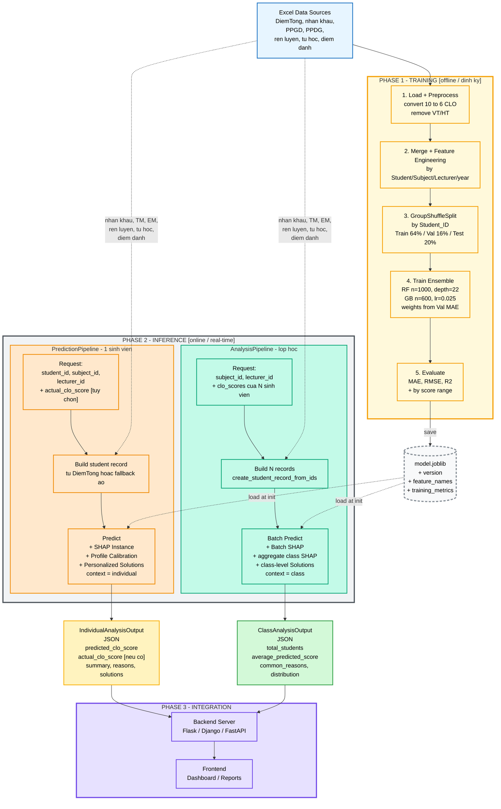

# Sơ đồ tổng thể hệ thống — `ml_clo`

Sơ đồ kiến trúc tổng quan thể hiện quan hệ giữa **3 pipeline chính** của thư viện `ml_clo` và cách chúng phối hợp để cung cấp dịch vụ dự báo + giải thích điểm CLO cho backend.

---

## 1. Ba pipeline trong hệ thống

| Pipeline | Vai trò | Chế độ |
|---|---|---|
| **TrainingPipeline** | Huấn luyện mô hình từ dữ liệu lịch sử → xuất `model.joblib` | Offline / định kỳ |
| **PredictionPipeline** | Dự đoán + giải thích cho **1 sinh viên** | Online / real-time |
| **AnalysisPipeline** | Phân tích cả **lớp học** | Online / real-time |

Hai pipeline inference (`PredictionPipeline` và `AnalysisPipeline`) **dùng chung 1 file mô hình** đã train (`model.joblib`) — đây là tài nguyên cầu nối giữa pha huấn luyện và pha triển khai.

---

## 2. Sơ đồ tổng thể



---

## 3. Ba phase chính của hệ thống

### Phase 1 — TRAINING (offline / định kỳ)

Pipeline `TrainingPipeline` chạy **một lần duy nhất** (hoặc theo lịch định kỳ — ví dụ mỗi học kỳ) để học từ dữ liệu lịch sử trên 7 file Excel. Đầu ra là **`model.joblib`** chứa:
- Hai mô hình thành phần (`RandomForestRegressor` + `GradientBoostingRegressor`).
- Trọng số kết hợp `w_RF`, `w_GB` đã học từ MAE trên tập Validation.
- Danh sách 76 đặc trưng (`feature_names`) và phiên bản mô hình.
- Bộ chỉ số huấn luyện (Train/Val/Test MAE-RMSE-R²).

**Đặc điểm**: chạy lâu (vài phút), cần quyền đọc đầy đủ file Excel, không phục vụ truy vấn real-time.

### Phase 2 — INFERENCE (online / real-time)

Sau khi có `model.joblib`, hai pipeline inference **chạy song song và độc lập**:

#### `PredictionPipeline` (cá nhân)
- Backend gọi với `student_id`, `subject_id`, `lecturer_id`.
- Tuỳ chọn truyền `actual_clo_score` (môn đã học có điểm thực).
- Có **2 nhánh xử lý**: lấy lịch sử từ `DiemTong` HOẶC dựng bản ghi "ảo" qua `create_student_record_from_ids` cho sinh viên chưa từng thi môn này.
- Dùng `explain_instance` cho 1 sinh viên → SHAP gom thành **7 nhóm sư phạm**.
- Đầu ra: `IndividualAnalysisOutput` với điểm dự báo + lý do + **giải pháp cá nhân hoá** (template `context="individual"`).

#### `AnalysisPipeline` (lớp học)
- Backend gọi với `subject_id`, `lecturer_id`, danh sách `clo_scores` của lớp.
- Dựng `N` bản ghi cho `N` sinh viên trong lớp.
- Dùng `explain_batch` rồi `aggregate_class_shap` → SHAP **trung bình toàn lớp** → 7 nhóm sư phạm.
- Đầu ra: `ClassAnalysisOutput` với điểm trung bình + lý do chung + **đề xuất can thiệp cấp lớp** (template `context="class"`).

**Đặc điểm chung**: chạy nhanh (< 1 giây cho 1 SV, vài giây cho lớp), trả JSON có thể serialize ngay.

### Phase 3 — INTEGRATION

JSON đầu ra được backend (Flask / Django / FastAPI) trả về frontend để hiển thị:
- Dashboard cho **giảng viên/cố vấn học tập**: xem cảnh báo cá nhân + báo cáo lớp.
- Báo cáo định kỳ cho **bộ môn**: phân tích phương pháp giảng dạy nào hiệu quả.
- Khuyến nghị **can thiệp sư phạm (LAI — Learning Analytics Intervention)**: kế hoạch hỗ trợ sinh viên rủi ro.

---

## 4. Bảng tham chiếu module (mapping sơ đồ ↔ code)

| Phase | Khối | Class / File |
|---|---|---|
| Training | TrainingPipeline | `src/ml_clo/pipelines/train_pipeline.py` |
| Storage | Pre-trained Model | `models/model.joblib` |
| Inference (cá nhân) | PredictionPipeline | `src/ml_clo/pipelines/predict_pipeline.py` |
| Inference (lớp) | AnalysisPipeline | `src/ml_clo/pipelines/analysis_pipeline.py` |
| Mô hình | EnsembleModel | `src/ml_clo/models/ensemble_model.py` |
| XAI | EnsembleSHAPExplainer | `src/ml_clo/xai/shap_explainer.py` |
| Reasoning | reason_generator, solution_mapper, templates | `src/ml_clo/reasoning/` |
| Output schemas | IndividualAnalysisOutput, ClassAnalysisOutput | `src/ml_clo/outputs/schemas.py` |
| CLI | train.py, predict.py, analyze_class.py | `scripts/` |

---

## 5. Đặc điểm nổi bật của kiến trúc tổng thể

### 5.1. Tách biệt Training và Inference

`model.joblib` là **giao diện duy nhất** giữa hai phase — backend không cần biết hệ thống đã được train như thế nào, chỉ cần load file là dùng được. Điều này cho phép:
- Train trên máy server mạnh có GPU.
- Triển khai inference trên container nhỏ (chỉ cần CPU).
- Cập nhật mô hình bằng cách đẩy file `.joblib` mới mà không cần redeploy code.

### 5.2. Hai pipeline inference dùng chung tài nguyên nhưng độc lập về luồng

`PredictionPipeline` và `AnalysisPipeline` cùng load **1 model**, **1 bộ file Excel nền** (nhân khẩu, PPGD, PPDG, ...) nhưng:
- Khác nhau về **đầu vào nghiệp vụ** (1 sinh viên vs danh sách điểm cả lớp).
- Khác nhau về **method SHAP** (`explain_instance` vs `explain_batch + aggregate`).
- Khác nhau về **template lý do/giải pháp** (`context="individual"` vs `context="class"`).
- Đầu ra **schema khác nhau** (Individual vs Class).

### 5.3. Thư viện không đóng gói model

`model.joblib` **không bundle** trong package — backend tự lưu trữ và truyền `model_path` khi khởi tạo pipeline. Điều này:
- Giữ kích thước package nhỏ (~5MB code, không có file ~200MB model).
- Cho phép mỗi tổ chức/khoa dùng model riêng phù hợp với dữ liệu của họ.
- Dễ kiểm soát version model qua file system / S3 / cloud storage.

### 5.4. Rule-based reasoning, không LLM

Toàn bộ logic sinh lý do/giải pháp đều dựa trên **template tiếng Việt rule-based** (`reasoning/templates.py`, `reasoning/solution_mapper.py`). Hệ thống **không gọi API LLM** vì:
- Đảm bảo tính **deterministic** (cùng đầu vào → cùng đầu ra).
- Không phụ thuộc dịch vụ ngoài, **không phát sinh chi phí token**.
- Kiểm soát hoàn toàn ngôn ngữ đầu ra (tránh hallucination, sai số chuyên môn).

### 5.5. Chống Data Leakage và Profile Calibration

- **Training phase** dùng `GroupShuffleSplit` theo `Student_ID` để chống leakage.
- **Inference phase** áp dụng `Profile Calibration` để tránh mâu thuẫn giữa SHAP và hồ sơ thực tế của sinh viên (ví dụ: hồ sơ rèn luyện rất tốt nhưng SHAP cho điểm âm ở nhóm Rèn luyện).

---

## 6. Caption cho luận văn (gợi ý)

> **Hình 4.x.** Kiến trúc tổng thể của hệ thống `ml_clo` cho bài toán dự báo và giải thích điểm CLO của sinh viên. Hệ thống gồm ba pha vận hành: (i) **Pha huấn luyện (Training)** chạy ngoại tuyến, đọc dữ liệu lịch sử từ 7 nguồn Excel và sản sinh tệp mô hình `model.joblib` đóng gói cùng metadata; (ii) **Pha suy luận (Inference)** chạy trực tuyến qua hai pipeline song song — `PredictionPipeline` cho dự báo cá nhân và `AnalysisPipeline` cho phân tích cấp lớp — cả hai dùng chung mô hình đã huấn luyện và các nguồn dữ liệu tham chiếu; (iii) **Pha tích hợp (Integration)** đưa các JSON đầu ra (`IndividualAnalysisOutput` và `ClassAnalysisOutput`) vào backend (Flask/Django/FastAPI) để hiển thị trên dashboard và sinh báo cáo. Việc tách biệt rõ ràng giữa pha huấn luyện và pha suy luận thông qua tệp `.joblib` cho phép cập nhật mô hình mà không cần triển khai lại mã nguồn, đồng thời giữ kích thước thư viện nhỏ gọn để dễ tích hợp.

---

## 7. So sánh ba pipeline ở mức tổng quan

| Khía cạnh | TrainingPipeline | PredictionPipeline | AnalysisPipeline |
|---|---|---|---|
| Tần suất chạy | Định kỳ (tháng/học kỳ) | Real-time (mỗi request) | Real-time (mỗi request) |
| Số sinh viên xử lý/lần | Hàng nghìn (toàn bộ DiemTong) | 1 | N (cả lớp) |
| Đầu vào chính | 7 file Excel | 3 ID + paths | subject + lecturer + clo_scores |
| Mô hình | Đang train | Đã có sẵn | Đã có sẵn |
| Cần SHAP? | Không | `explain_instance` | `explain_batch` + aggregate |
| Reasoning context | N/A | `individual` | `class` |
| Đầu ra | `model.joblib` | `IndividualAnalysisOutput` | `ClassAnalysisOutput` |
| Thời gian chạy | Vài phút | < 1s | Vài giây |

---

## 8. Liên kết với 3 sơ đồ chi tiết

| Sơ đồ chi tiết | File |
|---|---|
| Sơ đồ TrainingPipeline (đầy đủ 4 tầng) | [docs/training_pipeline.md](training_pipeline.md) |
| Sơ đồ PredictionPipeline (đầy đủ 4 tầng) | [docs/prediction_pipeline.md](prediction_pipeline.md) |
| Sơ đồ AnalysisPipeline (đầy đủ 5 tầng) | [docs/class_analysis_pipeline.md](class_analysis_pipeline.md) |

Sơ đồ tổng thể trong file này tập trung vào **quan hệ giữa các pipeline**; ba file kia mô tả chi tiết **luồng nội bộ** của từng pipeline.

---

## 9. Ghi chú render

- Mở [mermaid.live](https://mermaid.live) → paste khối ` ```mermaid ... ``` ` ở mục 2 → Actions → tải PNG/SVG.
- VS Code: cài extension *Markdown Preview Mermaid Support* để xem trực tiếp.
- Phối màu: Training (vàng — kho dữ liệu), Storage (xám đứt — tài nguyên), Individual (cam — riêng), Class (xanh ngọc — chung), Backend (tím — hệ thống), Output Individual (vàng đậm), Output Class (xanh lá).
