# Sơ đồ tổng thể — TrainingPipeline (Huấn luyện mô hình)

Mô tả luồng huấn luyện mô hình Ensemble (Random Forest + Gradient Boosting) cho bài toán dự báo điểm CLO 0–6, từ file Excel thô đến mô hình `.joblib` sẵn sàng triển khai.

---

## 1. Tóm tắt 7 bước chính (theo `TrainingPipeline.run()`)

| Bước | Hàm | Vai trò |
|---|---|---|
| ① | `load_data()` | Nạp 7 nguồn Excel (DiemTong bắt buộc + 6 file tuỳ chọn) |
| ② | `prepare_training_dataset()` | Hợp nhất dữ liệu theo `Student_ID/Subject_ID/Lecturer_ID/year` + xây dựng đặc trưng tổng hợp |
| ③ | `prepare_features()` | Tách `X`, `y`; mã hoá categorical bằng MD5 hash; điền NaN bằng median/0 |
| ④ | `split_data()` | `GroupShuffleSplit` theo `Student_ID` → Train 64% / Val 16% / Test 20% (chống data leakage) |
| ⑤ | `train()` | Huấn luyện `EnsembleModel` (RF + GB) — trọng số ensemble học từ MAE trên tập Val |
| ⑥ | `evaluate()` | Đánh giá trên Test bằng MAE/RMSE/R² + chi tiết theo dải điểm |
| ⑦ | `save_model()` | Lưu mô hình thành `.joblib` (kèm version + feature_names + metrics) |

---

## 2. Sơ đồ tổng thể

```mermaid
flowchart LR
    Input["Input<br/>DiemTong.xlsx [required]<br/>+ 6 file tuy chon:<br/>nhan khau, PPGD, PPDG,<br/>ren luyen, tu hoc, diem danh"]

    Entry["TrainingPipeline.run"]

    subgraph DL["Data Layer"]
        direction LR
        Load["1. Load Data<br/>load_exam_scores<br/>load_demographics<br/>load_teaching_methods<br/>load_assessment_methods<br/>load_conduct_scores<br/>load_study_hours<br/>load_attendance"]
        Pre["2. Preprocess<br/>preprocess_exam_scores<br/>convert 10 to 6 [CLO]<br/>remove VT/HT to NaN<br/>standardize IDs"]
        Merge["Merge<br/>create_training_dataset<br/>theo Student/Subject/<br/>Lecturer/year<br/>drop_missing_target"]
        FE["Feature Engineering<br/>build_all_features<br/>conduct_trend, pass_rate,<br/>recent_avg, academic_core,<br/>attendance_rate, ..."]
        PF["3. Prepare Features<br/>X, y, feature_names<br/>stable_hash MD5<br/>fillna: median/0"]
        Load --> Pre --> Merge --> FE --> PF
    end

    subgraph SP["Split Layer"]
        direction TB
        Split["4. GroupShuffleSplit<br/>theo Student_ID<br/>chong Data Leakage"]
        Train["Train ~64%"]
        Val["Validation ~16%"]
        Test["Test ~20%"]
        Split --> Train
        Split --> Val
        Split --> Test
    end

    subgraph ML["Model Layer"]
        direction TB
        RF["Random Forest<br/>n_estimators=1000<br/>max_depth=22<br/>min_samples_leaf=4"]
        GB["Gradient Boosting<br/>n_estimators=600<br/>max_depth=10<br/>learning_rate=0.025<br/>subsample=0.9"]
        Ens["5. Ensemble Model<br/>weighted blend<br/>w_RF, w_GB hoc tu Val MAE<br/>kep [0.1, 0.9]<br/>anti-anomaly blend"]
        RF --> Ens
        GB --> Ens
    end

    subgraph EL["Evaluation Layer"]
        direction TB
        Eval["6. Evaluate<br/>evaluate_model<br/>MAE, RMSE, R2"]
        EvalRange["By Score Range<br/>evaluate_by_score_range<br/>Thap 0-2 / TB 2-4 / Cao 4-6"]
        Eval --> EvalRange
    end

    Joblib[("7. Saved Model<br/>model.joblib<br/>+ version<br/>+ feature_names<br/>+ training_metrics")]

    Metrics["Training Metrics<br/>Train MAE/RMSE/R2<br/>Val MAE/RMSE/R2<br/>Test MAE/RMSE/R2"]

    Input --> Entry --> Load
    PF --> Split
    Train -- "X_train y_train" --> RF
    Train -- "X_train y_train" --> GB
    Val -- "X_val y_val" --> Ens
    Test -- "X_test y_test" --> Eval
    Ens --> Eval
    Ens -- "save" --> Joblib
    EvalRange --> Metrics

    classDef inputCls fill:#e7f5ff,stroke:#1971c2,stroke-width:2px,color:#000
    classDef dataCls fill:#fff9db,stroke:#f59f00,stroke-width:2px,color:#000
    classDef splitCls fill:#ffe3e3,stroke:#e03131,stroke-width:2px,color:#000
    classDef modelCls fill:#ffe8cc,stroke:#f08c00,stroke-width:2px,color:#000
    classDef evalCls fill:#e7e1ff,stroke:#7048e8,stroke-width:2px,color:#000
    classDef outputCls fill:#d3f9d8,stroke:#2f9e44,stroke-width:2px,color:#000

    class Input,Entry inputCls
    class Load,Pre,Merge,FE,PF dataCls
    class Split,Train,Val,Test splitCls
    class RF,GB,Ens modelCls
    class Eval,EvalRange evalCls
    class Joblib,Metrics outputCls

    style DL fill:#fff9db,stroke:#f59f00,stroke-width:3px
    style SP fill:#ffe3e3,stroke:#e03131,stroke-width:3px
    style ML fill:#ffe8cc,stroke:#f08c00,stroke-width:3px
    style EL fill:#e7e1ff,stroke:#7048e8,stroke-width:3px
```



---

## 3. Bảng tham chiếu module (mapping sơ đồ ↔ code)

| Khối trong sơ đồ | Hàm / Class | File |
|---|---|---|
| `TrainingPipeline.run()` | `run()` | `src/ml_clo/pipelines/train_pipeline.py:429` |
| ① Load Data | `load_exam_scores`, `load_demographics`, `load_teaching_methods`, `load_assessment_methods`, `load_conduct_scores`, `load_study_hours`, `load_attendance` | `src/ml_clo/data/loaders.py` |
| ② Preprocess | `preprocess_exam_scores` (convert 10→6, clean VT/HT, standardize IDs) | `src/ml_clo/data/preprocessors.py` |
| Merge | `create_training_dataset` | `src/ml_clo/data/mergers.py` |
| Feature Engineering | `build_all_features` | `src/ml_clo/features/feature_builder.py` |
| ③ Prepare Features | `prepare_features` (stable_hash + fillna) | `src/ml_clo/pipelines/train_pipeline.py:189` |
| ④ Split Data | `GroupShuffleSplit` (sklearn) | `src/ml_clo/pipelines/train_pipeline.py:256` |
| Random Forest | `RandomForestRegressor` (sklearn) | `src/ml_clo/models/ensemble_model.py:60` |
| Gradient Boosting | `GradientBoostingRegressor` (sklearn) | `src/ml_clo/models/ensemble_model.py:64` |
| ⑤ Ensemble Model train | `EnsembleModel.train()` | `src/ml_clo/models/ensemble_model.py` |
| ⑥ Evaluate | `evaluate_model`, `evaluate_by_score_range` | `src/ml_clo/models/model_evaluator.py` |
| ⑦ Save Model | `EnsembleModel.save()` | `src/ml_clo/models/base_model.py:95` |
| Cấu hình hyperparameter | `RANDOM_FOREST_CONFIG`, `GRADIENT_BOOSTING_CONFIG`, `ENSEMBLE_CONFIG`, `TRAINING_CONFIG` | `src/ml_clo/config/model_config.py` |

---

## 4. Đặc điểm nổi bật của Training Pipeline

### 4.1. Chống Data Leakage bằng `GroupShuffleSplit`

Mặc định `group_split_by_student=True` → một sinh viên **không xuất hiện đồng thời ở cả Train, Val, và Test**. Điều này quan trọng vì dữ liệu có nhiều bản ghi/sinh viên (mỗi môn học là 1 dòng), nếu chia ngẫu nhiên theo dòng sẽ làm mô hình "học lén" thông tin của sinh viên qua các môn khác → R² test bị thổi phồng giả tạo.

Có thể tắt qua flag `--no-group-split` nếu cần so sánh.

### 4.2. Tỷ lệ chia Train / Val / Test

```
Tổng dữ liệu sau merge
        │
        ├─ test_size=0.2 ──► Test (20%)
        │
        └─ phần còn lại (80%)
                │
                ├─ validation_size=0.2 ──► Val (16% của tổng = 0.8 × 0.2)
                │
                └─ Train (64% của tổng)
```

### 4.3. Trọng số ensemble được học, không cố định

`EnsembleModel.train()` không dùng trọng số `0.5/0.5` cố định mà:
1. Train RF và GB độc lập trên Train.
2. Đo `MAE_RF` và `MAE_GB` trên Val.
3. Tính trọng số nghịch đảo MAE → kẹp trong khoảng `[0.1, 0.9]`.
4. **Anti-anomaly blend**: nếu GB đưa ra dự báo lệch quá xa RF (MAE chênh lệch lớn), trọng số được "kéo lùi" về phía RF để tránh overfit theo GB.

### 4.4. Mã hoá categorical bằng MD5 hash (deterministic)

Thay vì `LabelEncoder` (cần fit/transform riêng), code dùng `stable_hash_int()` (MD5):
- Cùng một giá trị input → luôn ra cùng một số nguyên.
- Không cần lưu encoder; train/predict luôn nhất quán.
- Áp dụng cho `Subject_ID`, `Lecturer_ID`, và các cột object còn lại.

### 4.5. Loại bỏ feature `min_exam_score` thô

Đặc trưng `min_exam_score` (điểm thấp nhất của một sinh viên) dễ kéo cây quyết định lệch theo một môn cá biệt. Pipeline thay bằng `min_exam_score_adj` (clip theo nền median) trong `build_all_features` và **loại trừ tường minh** `min_exam_score` ở bước `prepare_features`.

---

## 5. CLI tương ứng

```bash
# Kích hoạt môi trường
source .venv/bin/activate
export PYTHONPATH="${PYTHONPATH}:$(pwd)/src"

# Train mô hình đầy đủ
python scripts/train.py \
  --exam-scores data/DiemTong.xlsx \
  --conduct-scores data/diemrenluyen.xlsx \
  --demographics data/nhankhau.xlsx \
  --teaching-methods data/PPGDfull.xlsx \
  --assessment-methods data/PPDGfull.xlsx \
  --study-hours data/tuhoc.xlsx \
  --attendance "data/Dữ liệu điểm danh Khoa FIRA.xlsx" \
  --output models/model.joblib

# Train với split ngẫu nhiên (KHÔNG khuyến nghị — chỉ để so sánh)
python scripts/train.py \
  --exam-scores data/DiemTong.xlsx \
  --output models/model_random.joblib \
  --no-group-split
```

---

## 6. Caption cho luận văn (gợi ý)

> **Hình 4.x.** Kiến trúc `TrainingPipeline` cho bài toán dự báo điểm CLO. Pipeline gồm bốn tầng tuần tự: (i) **Data Layer** thực hiện thu thập, tiền xử lý (chuyển thang điểm 10 → 6, loại các nhãn không hợp lệ như VT/HT), hợp nhất dữ liệu đa nguồn theo `Student_ID/Subject_ID/Lecturer_ID/year`, và xây dựng các đặc trưng tổng hợp; (ii) **Split Layer** sử dụng `GroupShuffleSplit` theo `Student_ID` với tỷ lệ Train/Validation/Test xấp xỉ 64% / 16% / 20% nhằm chống rò rỉ dữ liệu; (iii) **Model Layer** huấn luyện song song hai mô hình thành phần Random Forest (`n=1000, depth=22`) và Gradient Boosting (`n=600, lr=0.025`), sau đó học trọng số kết hợp từ MAE trên tập Validation kèm cơ chế anti-anomaly blend để hạn chế overfitting; (iv) **Evaluation Layer** đánh giá hiệu năng tổng hợp (MAE/RMSE/R²) và chi tiết theo dải điểm CLO. Mô hình cuối cùng được serialize thành tệp `.joblib` kèm phiên bản, danh sách đặc trưng, và bộ chỉ số huấn luyện để phục vụ triển khai trên backend.

---

## 7. Ghi chú render

- Mở [mermaid.live](https://mermaid.live) → paste khối ` ```mermaid ... ``` ` → Actions → tải PNG/SVG.
- VS Code: cài extension *Markdown Preview Mermaid Support* để xem trực tiếp.
- Phối màu theo tầng: Data (vàng), Split (đỏ — nhấn mạnh chống leakage), Model (cam), Evaluation (tím), Output (xanh lá), Input/Pipeline (xanh dương).
